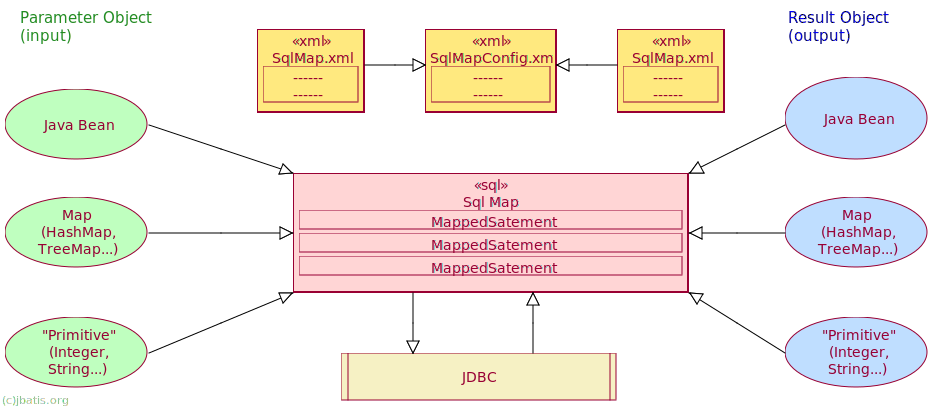
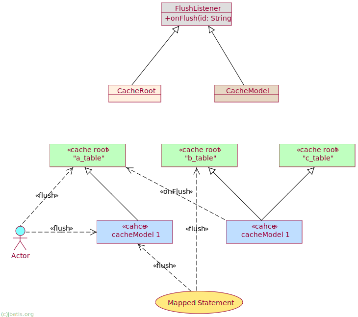
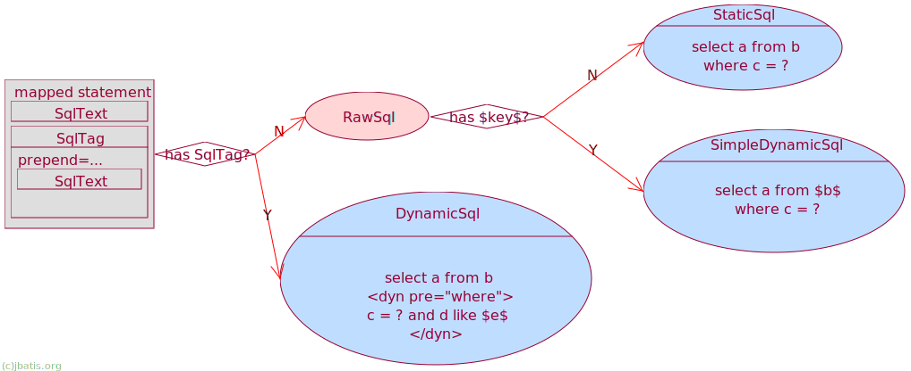
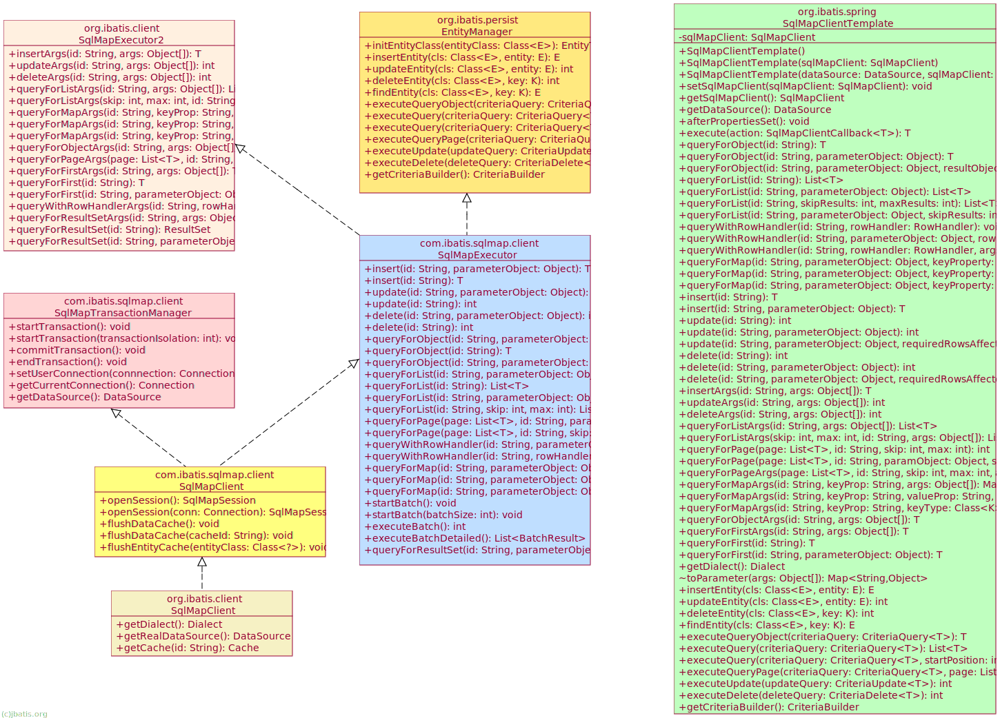

---:|:---
Version|2.4.8
Date|2018-10-30
[**jBATIS Persistence Framework Guide**]

[TOC levels=2-5 html ]: # "Table of Content"

## Introduction

**The jBATIS persistence framework is a succeeding framework for iBATIS Sql Map framework which was stopped at version 2.3.4.726.**

The iBATIS persistence framework will help you to significantly reduce the amount of Java code that you normally need to access a relational database.
iBATIS simply maps JavaBeans to SQL statements using a very simple XML descriptor.

Simplicity is the key advantage of iBATIS over other frameworks and object relational mapping tools.
To use the iBATIS SQL Map you need only be familiar with JavaBeans, XML and SQL.

There is very little else to learn. There is no complex scheme required to join tables or execute complex queries.
Using SQL Map you have the full power of real SQL at your fingertips.

### Concept
The iBATIS SQL Map API allows programmers to easily map JavaBeans objects to PreparedStatement parameters and ResultSets.
The philosophy behind SQL Map is simple:  provide a simple framework to provide 80% of JDBC functionality using only 20% of the code. 

### How does it work?
SQL Map provides a very simple framework for using XML descriptors to map JavaBeans, Map implementations, primitive wrapper types (String, Integer...) to an SQL statement. 

The following is a high level description of the lifecycle:

1. Provide an object as a parameter (either a JavaBean, Map or primitive wrapper). 
The parameter object will be used to set input values in an update statement, or where clause values in a query, ...   
2. Execute the mapped statement. This step is where the magic happens. 
The SQL Map framework will create a PreparedStatement instance, set any parameters using the provided parameter object,
execute the statement and build a result object from the ResultSet.
3. In the case of an update, the number of rows effected is returned.
In the case of a query, a single object, or a collection of objects is returned.
Like parameters, result objects can be a JavaBean, a Map, a primitive type wrapper. 

The diagram below illustrates the flow as described.



## Installation 
Installing the iBATIS SQL Map framework is simply a matter of placing the appropriate JAR files on the classpath. 
This can either be the classpath specified at JVM startup time (java -cp argument), or it could be the /WEB-INF/lib directory of a web application.

iBATIS comes with the following JAR files that should be on the classpath:

File Name|Description|Required
---|---|---
jbatis-2.4.7.jar|iBATIS Persistence Framework|YES

### JAR Files and Dependencies
When a framework has too many dependencies, it makes it difficult to integrate into an application and with other frameworks.
The following is a summary of when you would need to use the optional packages.

Description|When to Use|Dependency
---|---|---
Legacy JDK Support|If your JDK and app server doesn't already supply these JARs, then you will need these optional packages.|JDBC 3.0+, JTA 1.1+, Xerces 2.7.0+
DataSource Implementation|If you want to use the Jakarta DBCP connection pool.|DBCP 1.2+
Distributed Caching|If you want to use OSCache or Ehcache for centralized or distributed caching support.|OSCache 2.4+ or Ehcache 2.6+, and JGroups 3.6+
Springframework|If you want to use spring framework|Springframework 3.2+
Logging Solution|Please use Jakarta Commons Logging or Logback's JCL over SLF4J|Jakarta Commons Logging 1.1+ or JCL over SLF4J 1.7+

In additional, don't forget you also need your database specified JDBC Drivers.


## The SQL Map XML Configuration File 

SQL Map is configured using a central XML configuration file, which provides configuration details for DataSources,
SQL Map and other options like thread management..
The following is an example of the SQL Map configuration file: SqlMapConfig.xml

```xsql
<?xml version="1.0" encoding="UTF-8" ?>
<!DOCTYPE sqlMapConfig
    PUBLIC "-//ibatis.apache.org//DTD SQL Map Config 2.0//EN" "sql-map-config-2.dtd">
<!-- Always ensure to use the correct XML header as above! -->
<sqlMapConfig>
    <!-- The properties (name=value) in the file specified here can be used 
        placeholders in this config file (e.g. "${driver}". The file is relative 
        to the classpath and is completely optional. -->
    <properties
        resource="examples/sqlmap/maps/SqlMapConfigExample.properties" />

    <!-- These settings control SqlMapClient configuration details, primarily 
        to do with transaction management. They are all optional (more detail later 
        in this document). -->
    <settings cacheModelsEnabled="true" enhancementEnabled="true"
        lazyLoadingEnabled="true" useStatementNamespaces="false"
        defaultStatementTimeout="5" />

    <!-- This element declares a factory class that iBATIS will use for creating 
        result objects. This element is optional (more detail later in this document). -->
    <resultObjectFactory
        type="com.mydomain.MyResultObjectFactory">
        <property name="someProperty" value="someValue" />
    </resultObjectFactory>
    <!-- Type aliases allow you to use a shorter name for long fully qualified 
        class names. -->
    <typeAlias alias="order" type="testdomain.Order" />
    <!-- Configure a datasource to use with this SQL Map using SimpleDataSource. 
        Notice the use of the properties from the above resource -->
    <transactionManager type="JDBC">
        <dataSource type="SIMPLE">
            <property name="JDBC.Driver" value="${driver}" />
            <property name="JDBC.ConnectionURL" value="${url}" />
            <property name="JDBC.Username" value="${username}" />
            <property name="JDBC.Password" value="${password}" />
            <property name="JDBC.DefaultAutoCommit" value="true" />
            <property name="Pool.MaximumActiveConnections" value="10" />
            <property name="Pool.MaximumIdleConnections" value="5" />
            <property name="Pool.MaximumCheckoutTime" value="120000" />
            <property name="Pool.TimeToWait" value="500" />
            <property name="Pool.PingQuery" value="select 1 from ACCOUNT" />
            <property name="Pool.PingEnabled" value="false" />
            <property name="Pool.PingConnectionsOlderThan" value="1" />
            <property name="Pool.PingConnectionsNotUsedFor" value="1" />
        </dataSource>
    </transactionManager>
    <!-- Identify all SQL Map XML files to be loaded by this SQL map. Notice 
        the paths are relative to the classpath. For now, we only have one... -->
    <sqlMap resource="examples/sqlmap/maps/Person.xml" />
</sqlMapConfig>
```
The following sections of this document discuss the various sections of the SQL Map configuration file.


### `ibatis.ini`

`ibatis.ini` in classpath is used by jBATIS Framework and SimpleDataSource as global default properties and loaded automatically.
Normally, `ibatis.ini` wrote as following:
```prop
Pool.PingIdleConnectionsAfter=100000
Pool.EraseIdleConnectionsAfter=900000
cglib_cache_size=2048
sql_executor_class=org.ibatis.client.SqlExecutor
sql_executor_threshold=2000
sql_executor_page_threshold=60000
sql_executor_debug_sql=true
sql_executor_stats_sql=true
sql_executor_check_sql=true
run_stats_file=/path/file
```
In above, using `org.ibatis.client.SqlExecutor` to debug and stats runtime info.
if `sql_executor_debug_sql` is `true`, each executed sql and its arguments and elapsed time will be log out.
if `sql_executor_check_sql` is `true`, sql statements will be checked at startup.
if `sql_executor_stats_sql` is `true`, each executed sql and its elapsed time will be counted.

### The `<properties>` Element

The SQL Map can have a single `<properties>` element that allows a standard Java properties file to be associated with the SQL Map XML configuration document. 
By doing so, each named value in the properties file can become a variable that can be referred to in the SQL Map configuration file and all SQL Map referenced within. 

For example, if the properties file contains the following:
```prop
    driver=org.hsqldb.jdbcDriver
```
Then the SQL Map configuration file or each SQL Map referenced by the configuration document can use the placeholder ${driver} as a value that will be replaced by org.hsqldb.jdbcDriver.
For example:
```xsql
    <property name="JDBC.Driver" value="${driver:com.mysql.jdbc.Driver}"/>
```
Note that `com.mysql.jdbc.Driver` is the default value if not `driver` property found in jBATIS's global properties.

This comes in handy during building, testing and deployment. It makes it easy to reconfigure your app for multiple environments or use automated tools for configuration (e.g. Ant).
The properties can be loaded from the classpath (use the resource attribute) or from any valid URL (use the url attribute).

For example, to load a fixed path file, use: 
```xsql
    <properties url="file:///c:/config/my.properties" />
```

**Specially, properties in `ibatis.ini` would override the properties in `<properties>` element.**

### The `<settings>` Element
The `<settings>` element allows you to configure various options and optimizations for the SqlMapClient instance that will be built using this XML file. 
The settings element and all of its attributes are completely optional. The attributes supported and their various behaviors are described in the following table:

Property name|Description|Example|Default value
---|---|---|---
cacheModelsEnabled|This setting globally enables or disables all cache models for an SqlMapClient. This can come in handy for debugging.|cacheModelsEnabled="true"|true (enabled)
lazyLoadingEnabled|This setting globally enables or disables all lazy loading for an SqlMapClient. This can come in handy for debugging. |lazyLoadingEnabled="true"|false (disabled)
enhancementEnabled|This setting enables runtime bytecode enhancement to facilitate optimized JavaBean property access as well as enhanced lazy loading.|enhancementEnabled="true"|true (enabled)
classInfoCacheEnabled|This setting globally enables or disables caching the class info for runtime bytecode generation. |classInfoCacheEnabled="true"|true (enabled)
useStatementNamespaces|With this setting enabled, you must always refer to mapped statements by their fully qualified name, which is the combination of the sqlMap name and the statement name.|useStatementNamespaces="false"|false (disabled)
defaultStatementTimeout|This setting is an integer value that will be applied as the JDBC query timeout for all statements. This value can be overridden with the "statement" attribute of any mapped statement.|defaultStatementTimeout="10000"|n/a
statementCachingEnabled|Enables or disables cache prepared statement in current session scope for better performance.|statementCachingEnabled="true"|true (enabled)
useColumnLabel|Enables or disables use column label to retrieve data from jdbc resultset|useColumnLabel="true"|false (disabled, use column name)
forceMultipleResultSetSupport|Forcely support retrieve multiple result set from jdbc statement.|forceMultipleResultSetSupport="true"|false (disabled)
jdbcTypeForNull|Specify the defualt JDBC type for null parameter.|jdbcTypeForNull="VARCHAR" for oracle|n/a
defaultCacheModelType|Default cache model type such as LRU or OSCACHE.|defaultCacheModelType="EHCACHE"|n/a
forceCacheModelType|Forcely default cache model type such as LRU or OSCACHE.|forceCacheModelType="EHCACHE"|n/a
databasePagingQueryEnabled|Enables or disables modify sql before jdbc exection to use database limit/offset support.|databasePagingQueryEnabled="true"|true (enabled)

>***Important Notes:***

>* Because `lazyLoadingEnabled=true` would broken the n-Tier layer structure, so disabled by default.
>* `enhancementEnabled` and `classInfoCacheEnabled` is enabled by default for better performance.

### The `<resultObjectFactory>` Element
The `resultObjectFactory` element allows you to specify a factory class for creating objects resulting from the execution of SQL statements. 

This element is optional - if you don't specify the element, iBATIS will use internal mechanisms to create result objects (`class.newInstance()`).

iBATIS creates result objects in these cases:

1. When mapping rows returned from a ResultSet (the most common case)
2. When you use a nested select statement on a result element in a resultMap.
If the nested select statement declares a parameterClass, then iBATIS will create and populate an instance of the class before executing the nested select
3. When executing stored procedures - iBATIS will create objects for OUTPUT parameters
4. When processing nested result maps.
If the nested result map is used in conjunction with the `groupBy` support for avoiding N+1 queries,
then the object will typically be an implementation of type Collection, List, or Set.
You can provide custom implementations of these interfaces through the result object factory if you wish. In a 1:1 join with a nested result map,
then iBATIS will create an instance of the specified domain object through this factory.

If you choose to implement a factory, your factory class must implement the interface `com.ibatis.sqlmap.engine.mapping.result.ResultObjectFactory`,
and your class must have a public default constructor. The ResultObjectFactory interface has two methods - one to create an object,
and one to accept any property values specified in the configuration.
For example, suppose you specify a resultObjectFactory configuration element like this:
```xsql
    <resultObjectFactory type="com.mydomain.MyResultObjectFactory">
        <property name="someProperty" value="someValue" />
    </resultObjectFactory>
```
Then you should code a result object factory class like this:

```java
package com.mydomain;

import com.ibatis.sqlmap.engine.mapping.result.ResultObjectFactory;

public class MyResultObjectFactory implements ResultObjectFactory {
    public MyResultObjectFactory() {
        super();
    }

    public Object createInstance(String statementId, Class clazz)
        throws InstantiationException, IllegalAccessException {
        // create and return instances of clazz here...

    }

    public void setProperty(String name, String value) {
        // save property values here...
    }
}
```

iBATIS will call the `setProperty` method once for each property specified in the configuration.
All properties will be set before any call to the `createInstance ` method is processed.

iBATIS will call the `createInstance ` method every time an object needs to be created according to the cases mentioned above.
If you return null from the `createInstance ` method, then iBATIS will attempt to create the object through its normal means (`class.newInstance()`).
If you return null from a request to create `java.util.Collection` or `java.util.List`, then iBATIS will create `java.util.ArrayList`.
If you return null from a request to create `java.util.Set`, then iBATIS will create `java.util.HashSet`.
iBATIS passes the current statement id to let you know the context in which the object create is requested.

### The `<typeAlias>` Element
The `typeAlias` element simply allows you to specify a shorter name to refer to what is usually a long, fully qualified class name.

For example:
```xsql
    <typeAlias alias="shortname" type="com.long.class.path.Class" />
```
There are some predefined aliases used in the SQL Map Config file. They are:

---|---
JDBC|com.ibatis.sqlmap.engine.transaction.jdbc.JdbcTransactionConfig
JTA|com.ibatis.sqlmap.engine.transaction.jta.JtaTransactionConfig
EXTERNAL|com.ibatis.sqlmap.engine.transaction.external.ExternalTransactionConfig
[Transaction Manager Aliases]

---|---
SIMPLE|com.ibatis.sqlmap.engine.datasource.SimpleDataSourceFactory
DBCP|com.ibatis.sqlmap.engine.datasource.DbcpDataSourceFactory
JNDI|com.ibatis.sqlmap.engine.datasource.JndiDataSourceFactory    
[Data Source Factory Aliases]

### The `<transactionManager>` Element

The `<transactionManager>` element allows you to configure the transaction management services for an SQL Map.
The type attribute indicates which transaction manager to use.
The value can either be a class name or a type alias.
The three transaction managers included with the framework are: JDBC, JTA and EXTERNAL. 

---|---
JDBC|This allows JDBC to control the transaction via the usual Connection commit() and rollback() methods. 
JTA|This transaction manager uses a JTA global transaction . This configuration requires a UserTransaction property set to locate the user transaction from a JNDI resource. See the JNDI datasource example below for an example of this configuration.
EXTERNAL|This allows you to manage transactions on your own. You can still configure a data source, but transactions will not be committed or rolled back as part of the framework lifecycle. 

The `<transactionManager>` element also allows an optional attribute commitRequired that can be true or false.
Normally iBATIS will not commit transactions unless an insert, update, or delete operation has been performed.

**This is true even if you explicitly call the commitTransaction() method.** This behavior creates problems in some cases.
If you want iBATIS to always commit transactions, even if no insert, update, or delete operation has been performed,
then set the value of the commitRequired attribute to true.

Examples of where this attribute is useful include:

1. If you call a stored procedures that updates data as well as returning rows.
In that case you would call the procedure with the queryForList() operation - so iBATIS would not normally commit the transaction.
But then the updates would be rolled back.
2. In a WebSphere environment when you are using connection pooling and you use the JNDI `<dataSource>` and the JDBC or JTA transaction manager.
WebSphere requires all transactions on pooled connections to be committed or the connection will not be returned to the pool.

Note that the commitRequired attribute has no effect when using the EXTERNAL transaction manager.
Some of the transaction managers allow extra configuration properties.

The following table shows extra properties that are available for the various transaction managers:

Transaction Manager|Property|Description
---|---|---
EXTERNAL|DefaultAutoCommit|If "true", then setAutoCommit(true) will be called on the underlying connection for each transaction if that is not the value supplied by the underlying datasource. This behavior can be overridden with the "SetAutoCommitAllowed" property.
EXTERNAL|SetAutoCommitAllowed|If "true" or unspecified, then the behavior specified in the "DefaultAutoCommit" property will occur. If "false", then iBATIS will not call setAutoCommit in any case - this is useful in environments like WebSphere where the setAutoCommit method should not be called in any circumstance.
JTA|UserTransaction|This property is required. The value of the user transaction. Note that in many cases this should be set to "java:comp/UserTransaction"
        
### The `<dataSource>` Element
Included as part of the transaction manager configuration is a dataSource element and a set of properties to configure a DataSource for use with your SQL Map.
There are currently three datasource factories provided with the framework, but you can also write your own. The included DataSourceFactory implementations are discussed in further detail below and example configurations are provided for each.

#### SimpleDataSourceFactory
The SimpleDataSource factory provides a basic implementation of a pooling DataSource that is ideal for providing connections in cases
where there is no container provided DataSource. It is based on the iBATIS SimpleDataSource connection pool implementation.
```xsql
    <transactionManager type="JDBC">
        <dataSource type="SIMPLE">
            <property name="JDBC.Driver" value="org.postgresql.Driver" />
            <property name="JDBC.ConnectionURL"
                value="jdbc:postgresql://server:5432/dbname" />
            <property name="JDBC.Username" value="user" />
            <property name="JDBC.Password" value="password" />
            <!-- OPTIONAL PROPERTIES BELOW -->
            <property name="JDBC.DefaultAutoCommit" value="false" />
            <property name="Pool.MaximumActiveConnections" value="10" />
            <property name="Pool.MaximumIdleConnections" value="5" />
            <property name="Pool.MaximumCheckoutTime" value="120000" />
            <property name="Pool.TimeToWait" value="10000" />
            <property name="Pool.PingQuery" value="select * from dual" />
            <property name="Pool.PingEnabled" value="false" />
            <property name="Pool.PingConnectionsOlderThan" value="0" />
            <property name="Pool.PingConnectionsNotUsedFor" value="0" />
            <property name="Driver.DriverSpecificProperty" value="SomeValue" />
        </dataSource>
    </transactionManager>
```

Note that any property prefixed with "Driver." will be added as a property to the underlying JDBC driver.
#### DbcpDataSourceFactory
This implementation uses Jakarta DBCP (Database Connection Pool) to provide connection pooling services via the DataSource API.
This DataSource is ideal where the application/web container cannot provide a DataSource implementation, or you're running a standalone application. 
iBATIS provides direct access to setting the properties of a DBCP datasource by allowing you to specify any DBCP property name you desire in the configuration.

For example:
```xsql
    <transactionManager type="JDBC">
        <dataSource type="DBCP">
            <property name="driverClassName" value="${driver}" />
            <property name="url" value="${url}" />
            <property name="username" value="${username}" />
            <property name="password" value="${password}" />
            <!-- OPTIONAL PROPERTIES BELOW -->
            <property name="maxActive" value="10" />
            <property name="maxIdle" value="5" />
            <property name="maxWait" value="60000" />
            <!-- Use of the validation query can be problematic. If you have difficulty, 
                try without it. -->
            <property name="validationQuery"
                value="select * from ACCOUNT" />
            <property name="logAbandoned" value="false" />
            <property name="removeAbandoned" value="false" />
            <property name="removeAbandonedTimeout" value="50000" />
            <property name="Driver.DriverSpecificProperty" value="SomeValue" />
        </datasource>
    </transactionManager>
```
You can see all available properties here: [http://commons.apache.org/proper/commons-dbcp/configuration.html](http://commons.apache.org/proper/commons-dbcp/configuration.html)

Note that any property prefixed with "Driver." will be added as a property to the underlying JDBC driver as shown above.

iBATIS also supports a less flexible legacy configuration option as show below. However, we recommend that you use the configuration option shown above.
```xsql
    <transactionManager type="JDBC">  <!-- Legacy DBCP Configuration -->
        <dataSource type="DBCP">
            <property name="JDBC.Driver" value="${driver}" />
            <property name="JDBC.ConnectionURL" value="${url}" />
            <property name="JDBC.Username" value="${username}" />
            <property name="JDBC.Password" value="${password}" />
            <!-- OPTIONAL PROPERTIES BELOW -->
            <property name="Pool.MaximumActiveConnections" value="10" />
            <property name="Pool.MaximumIdleConnections" value="5" />
            <property name="Pool.MaximumWait" value="60000" />
            <!-- Use of the validation query can be problematic. If you have difficulty, 
                try without it. -->
            <property name="Pool.ValidationQuery" value="select * from ACCOUNT" />
            <property name="Driver.DriverSpecificProperty" value="SomeValue" />
        </datasource>
    </transactionManager>
```

The properties shown are the only properties recognized by iBATIS when using the legacy configuration option.
Note that any property prefixed with "Driver." will be added as a property to the underlying JDBC driver as shown above.

#### JndiDataSourceFactory
This implementation will retrieve a DataSource implementation from a JNDI context from within an application container.
This is typically used when an application server is in use and a container managed connection pool and associated DataSource implementation are provided.
The standard way to access a JDBC DataSource implementation is via a JNDI context. JndiDataSourceFactory provides functionality to access such a DataSource via JNDI.
The configuration parameters that must be specified in the datasource stanza are as follows:
```xsql
    <transactionManager type="JDBC">
        <dataSource type="JNDI">
            <property name="DataSource" value="java:comp/env/jdbc/jpetstore" />
        </dataSource>
    </transactionManager>
```
The above configuration will use normal JDBC transaction management. 
But with a container managed resource, you might also want to configure it for global transactions as follows:

```xsql
    <transactionManager type="JTA">
        <property name="UserTransaction" value="java:/comp/UserTransaction" />
        <dataSource type="JNDI">
            <property name="DataSource" value="java:comp/env/jdbc/jpetstore" />
        </dataSource>
    </transactionManager>
```
Notice the `UserTransaction` property that points to the JNDI location where the UserTransaction instance can be found.
This is required for JTA transaction management so that your SQL Map take part in a wider scoped transaction involving other databases and transactional resources.
JNDI context properties can be added before the lookup by specifying additional properties with a prefix of "context.". For example:
```xsql
    <property name="context.java.naming.provider.url" value= "ldap://somehost:389"/>
```

### The `<sqlMap>` Element

The sqlMap element is used to explicitly include an SQL Map or another SQL Map Configuration file. 
Each SQL Map XML file that is going to be used by this SqlMapClient instance, must be declared.
The SQL Map XML files will be loaded as a stream resource from the classpath or from a URL.
You must specify any and all SQL Map (as many as there are). Here are some examples:

```xsql
    <!-- CLASSPATH RESOURCES -->
    <sqlMap resource="com/ibatis/examples/sql/Customer.xml" />
    <sqlMap resource="com/ibatis/examples/sql/Account.xml" />
    <sqlMap resource="com/ibatis/examples/sql/Product.xml" />
    <!-- URL RESOURCES -->
    <sqlMap url="file:///c:/config/Customer.xml" />
    <sqlMap url="file:///c:/config/Account.xml" />
    <sqlMap url="file:///c:/config/Product.xml" />
```
The next several sections detail the structure of these SQL Map XML files.

### The Global Properties

jBATIS holds alwarys a global properties for variable calculation at runtime. The global properties is setup in following order:

1. Populate from `System.getProperties()`, thus they can be overrided by subsequent sources.
2. From `<sqlMapConfig><properties ...>` if exists.
3. From `org.ibatis.client.SqlMapClientBuilder.buildSqlMapClient(..., Properties ...)` or `org.ibatis.spring.SqlMapClientFactoryBean#sqlMapClientProperties` if exists.
4. From `ibatis.ini` in classpath if exists.

>***Important Notes:***

>Some properties may only be read from `ibatis.ini` because they are used outside of a jBATIS Framework instance or at static class level.

User|Property Name|Description|Default Value
---|---|---|---
`MEMORY` Cache|`memory.mcast.enable`|Enable memory multicast its flush event|`false`
`MEMORY` Cache|`memory.mcast.properties`|Used by JGroups|n/a
`MEMORY` Cache|`memory.mcast.addr`|JGroups multicast address|`231.6.7.8`
`MEMORY` Cache|`memory.mcast.port`|JGroups multicast port|`44566`
SimpleDataSource|Any property name, override the params of its constructor `SimpleDataSource(Map<Object, Object>)`|For any use|n/a
Bytecode Cache|`cglib_cache_size`|Max number of cache entries|2048
[Properties always from `ibatis.ini`]

User can also obtain a global property by API `org.ibatis.client.PropertyProvider.getGlobalProperty(String)` 
via `org.ibatis.client.SqlMapClient` or `org.ibatis.spring.SqlMapClientTemplate`.

If want to obtain properties of `ibatis.ini`, One can use API `com.ibatis.common.resources.Resources.getIbatisIniProperties()`.

## The SQL Map XML File

In the examples above, we saw the most simple forms of SQL Map. 
There are other options available within the SQL Map document structure.
Here is an example of a mapped statement that makes use of more features.

```xsql
<?xml version="1.0" encoding="UTF-8"?>

<!DOCTYPE sqlMap PUBLIC "-//iBATIS.org//DTD SQL Map 2.4//EN" "sql-map-2.4.dtd">
<sqlMap namespace="Product">
    <cacheModel id="productCache" type="LRU">
        <flushInterval hours="24" />
        <property name="size" value="1000" />
    </cacheModel>
    <typeAlias alias="product" type="com.ibatis.example.Product" />
    <parameterMap id="productParam" class="product">
        <parameter property="id" />
    </parameterMap>
    <resultMap id="productResult" class="product">
        <result property="id" column="PRD_ID" />
        <result property="description" column="PRD_DESCRIPTION" />
    </resultMap>
    <select id="getProduct" parameterMap="productParam" resultMap="productResult" cacheModel="product-cache">
        SELECT
            *
        FROM
            PRODUCT
        WHERE
            PRD_ID = ?
    </select>
</sqlMap>
```

**TOO MUCH?**  Although the framework is doing a lot for you, that might seem like a lot of extra work (XML) for a simple select statement.
Worry not. Here's a shorthand version of the above.
```xsql
<?xml version="1.0" encoding="UTF-8"?>

<!DOCTYPE sqlMap PUBLIC "-//iBATIS.org//DTD SQL Map 2.4//EN" "sql-map-2.4.dtd">
<sqlMap namespace="Product">
    <select id="getProduct" parameterClass="com.ibatis.example.Product" resultClass="com.ibatis.example.Product">
        SELECT
            PRD_ID          AS id,
            PRD_DESCRIPTION AS description
        FROM
            PRODUCT
        WHERE
            PRD_ID = #id#
    </select>
</sqlMap>
```
Now, these statements aren't exactly equal in terms of the SQL Map behavior -there are some differences. 
First, the latter statement does not define a cache, and therefore every request will hit the database. 
Second, the latter statement uses auto-mapping features of the framework, which can create some overhead.
However, both of these statements would be executed exactly the same way from your Java code and therefore
you can start with the simpler solution first and move to the more advanced mapping as needed in the future. 

Simplest solution first is best practice in many modern methodologies.
A single SQL Map XML file can contain as many cache models, parameter maps, result maps and statements as you like. 
Use discretion and organize the statements and maps appropriately for your application (group them logically).

>***Important Notes:***

>There are 2 DTDs for SQL Map XML file in jBATIS, one is `sql-map-2.dtd`, it erase dom/xml support in iBATIS, and another is `sql-map-2.4.dtd`, 
it provide more dynamic tag alias and more cache operations from `sql-map-2.dtd`.

### Doctypes in jBATIS

Doctype|Public ID|System ID|Real DTD
---:|---|---|---
`sqlMapConfig`|`-//iBATIS.com//DTD SQL Map Config 2.0//EN`| |sql-map-config-2.dtd
`sqlMapConfig`| |`http://www.ibatis.com/dtd/sql-map-config-2.dtd`|sql-map-config-2.dtd
`sqlMapConfig`|`-//ibatis.apache.org//DTD SQL Map Config 2.0//EN`| |sql-map-config-2.dtd
`sqlMapConfig`| |`http://ibatis.apache.org/dtd/sql-map-config-2.dtd`|sql-map-config-2.dtd
`sqlMap`|`-//iBATIS.com//DTD SQL Map 2.0//EN`| |sql-map-2.dtd
`sqlMap`| |`http://www.ibatis.com/dtd/sql-map-2.dtd`|sql-map-2.dtd
`sqlMap`|`-//ibatis.apache.org//DTD SQL Map 2.0//EN`| |sql-map-2.dtd
`sqlMap`| |`http://ibatis.apache.org/dtd/sql-map-2.dtd`|sql-map-2.dtd
`sqlMap`|`-//iBATIS.org//DTD SQL Map 2.4//EN`| |**sql-map-2.4.dtd**
[Doctypes in jBATIS]

## Mapped Statements

The SQL Map concept is centered around mapped statements.
Mapped statements can be any SQL statement and can have parameter maps (input) and result maps (output).
If the case is simple, the mapped statement can be configured directly to a class for parameters and results.
The mapped statement can also be configured to use a cache model to cache popular results in memory.
```xsql
    <statement id="statementName" 
           [parameterClass="some.class.Name"]
           [resultClass="some.class.Name"]
           [parameterMap="nameOfParameterMap"]
           [resultMap="nameOfResultMap"]
           [cacheModel="nameOfCache"]
           [timeout="5"]>
        select * from PRODUCT where PRD_ID = [?|#propertyName#]
        order by [$simpleDynamic$]
    </statement>
```
Where statement can be any of insert, update, delete, select, procedure, or statement.
In the above statement, the **[bracketed]** parts are optional and in some cases only certain combinations are allowed.
So it is perfectly legal to have a Mapped Statement with as simple as this:
```xsql
    <insert id="insertTestProduct">
        INSERT
        INTO
            PRODUCT
            (
                PRD_ID,
                PRD_DESCRIPTION
            )
        VALUES
            (
                1,
                "Shih Tzu"
            )
    </insert>
```
The above example is obviously unlikely, however this can come in handy if you want to simply make use of the SQL Map framework for executing arbitrary SQL statements.
However, it will be more common to make use of the JavaBeans mapping features using Parameter Maps and Result Maps, as that is where the true power is.
The next several sections describe the structure and attributes and how they effect the mapped statement.

### Statement Types
The `<statement>` element is a general "catch all" statement that can be used for any type of SQL statement.
Generally it is a good idea to use one of the more specific statement elements.
The more specific elements provide a more intuitive XML DTD and sometimes provides additional features that a normal `<statement>` element cannot.
The following table summarizes the statement elements and their supported attributes and features:

Statement Element|Attributes|Child Elements|Methods
---|---|---|---
`<sql>`|`id`|All dynamic elements, `<include>`|n/a
`<include>`|`refid`|n/a|n/a
`<statement>`|`id parameterClass resultClass parameterMap resultMap cacheModel resultSetType fetchSize remapResults timeout canBatch`|All dynamic elements and `<include>`|insert update delete, All query methods
`<insert>`|`id parameterClass parameterMap timeout noBatch`|All dynamic elements, `<selectKey>` and `<include>`|insert update delete
`<selectKey>`|`resultClass keyProperty type`|n/a|n/a
`<update>`|`id parameterClass parameterMap timeout noBatch`|All dynamic elements and `<include>`|insert update delete
`<delete>`|`id parameterClass parameterMap timeout noBatch`|All dynamic elements and `<include>`|insert update delete
`<select>`|`id parameterClass resultClass parameterMap resultMap cacheModel resultSetType fetchSize remapResults timeout`|All dynamic elements and `<include>`|All query methods
`<procedure>`|`id parameterClass resultClass parameterMap resultMap cacheModel fetchSize remapResults timeout canBatch`|All dynamic elements and `<include>`|insert update delete, All query methods

>***Important Notes:***

>You need use `sql-map-2.4.dtd` for SQL Map XML to use `noBatch` or `canBatch` attributes.

### The SQL
The SQL is obviously the most important part of the map. It can be any SQL that is valid for your database and JDBC driver.
You can use any functions available and even send multiple statements as long as your driver supports it.
Because you are combining SQL and XML in a single document, there is potential for conflicting special characters.
The most common obviously is the greater-than and less-than symbols (`<>`). These are commonly required in SQL and are reserved symbols in XML.

There is a simple solution to deal with `<` as `&lt;` and `>` as `&gt;`, 
Then some advanced IDE such as **jbatis-ide** can format them normally and even convert them automatically.

For example:

```xsql
    <select id="getPersonsByAge" parameterClass="int" resultClass="examples.domain.Person">
        SELECT
            *
        FROM
            PERSON
        WHERE
            AGE &gt; #value#
    </select>
```

### Reusing SQL Fragments

When writing SqlMaps, you often encounter duplicate fragments of SQL, for example a FROM-clause or constraint-statement.
iBATIS offers a simple yet powerful tag to reuse them.

For the sake of simplicity, let's assume we want to get some items and we want to do a count on them.
Normally, you would write something like this:
```xsql
    <select id="selectItemCount" resultClass="int">
        SELECT
            COUNT(*) AS total
        FROM
            items
        WHERE
            parentid = 6
    </select>
    <select id="selectItems" resultClass="Item">
        SELECT
            id,
            name
        FROM
            items
        WHERE
            parentid = 6
    </select>
```
To eliminate this duplication, we use the tags `<sql>` and `<include>`.
The `<sql>` tag contains the fragment to reuse, the `<include>` tag includes such a fragment in a statement.

For example:

```xsql
    <sql id="selectItem_fragment">
        FROM
            items
        WHERE
            parentid = 6
    </sql>
    <select id="selectItemCount" resultClass="int">
        SELECT
            COUNT(*) AS total
        <include refid="selectItem_fragment" />
    </select>
    <select id="selectItems" resultClass="Item">
        SELECT
            id,
            name
        <include refid="selectItem_fragment" />
    </select>
```

The `<include>` tag is namespace aware so you can refer to fragments even when they are located in another map
(however, due to the way iBATIS loads the SqlMaps, the included fragment should be loaded before the including statement).

The fragments are included and processed on query-execution so parameters can be used too:
```xsql
    <sql id="selectItem_fragment">
        FROM
            items
        WHERE
            parentid = #value#
    </sql>
    <select id="selectItemCount" parameterClass="int" resultClass="int">
        SELECT
            COUNT(*) AS total
        <include refid="selectItem_fragment" />
    </select>
    <select id="selectItems" parameterClass="int" resultClass="Item">
        SELECT
            id,
            name
        <include refid="selectItem_fragment" />
    </select>
```

### Auto-Generated Keys
Many relational database systems support auto-generation of primary key fields. This feature of the RDBMS is often (if not always) proprietary. 

SQL Map supports auto-generated keys via the `<selectKey>` stanza of the `<insert>` element.
Both pre-generated keys (e.g. Oracle) and post-generated (MS-SQL Server) keys are supported. 
Here are a couple of examples:
```xsql

    <!-- Oracle SEQUENCE Example -->
    <insert id="insertProduct-ORACLE" parameterClass="com.domain.Product">
        <selectKey resultClass="int">
            SELECT STOCKIDSEQUENCE.NEXTVAL AS ID FROM DUAL
        </selectKey>
            INSERT
            INTO
                PRODUCT
                (
                    PRD_ID,
                    PRD_DESCRIPTION
                )
            VALUES
                (
                    #id#,
                    #description#
                )
    </insert>
    <!-- Microsoft SQL Server IDENTITY Column Example -->
    <insert id="insertProduct-MS-SQL" parameterClass="com.domain.Product">
        INSERT
        INTO
            PRODUCT
            (
                PRD_DESCRIPTION
            )
        VALUES
            (
                #description#
            )
        <selectKey resultClass="int">SELECT @@IDENTITY AS ID</selectKey>
    </insert>
    <!-- JDBC Example, use java.sql.Statement#getGeneratedKeys() -->
    <insert id="insertProduct" parameterClass="com.domain.Product">
        INSERT
        INTO
            PRODUCT
            (
                PRD_DESCRIPTION
            )
        VALUES
            (
                #description#
            )
        <selectKey resultClass="long"/>
        <!-- Empty selectKey element means use JDBC's Statement.getGeneratedKeys() API. -->
    </insert>
```
The `selectKey` statement is executed before the insert statement if it is placed before the insert SQL,
otherwise the `selectKey` statement is executed after the insert statement.

In the previous examples, the Oracle example shows that the selectKey will be executed before the insert statement (as is appropriate for a sequence).
The SQL Server example shows that the selectKey statement will be executed after the insert statement (as is appropriate for an identity column).
With jBATIS, you can explicitly state the order of execution of the statements if you wish.
The `selectKey` element supports an attribute type that can be used to explicitly set the execution order.

The value of the type attribute can be either "pre" or "post" - meaning that the statement will be executed before or after the insert statement.
If you specify the type attribute, then the value you specify will be used regardless of the position of the selectKey element.
For example, in the following statement the selectKey statement will be executed before the insert statement,
even though the element is placed after the insert statement.
```xsql
    <insert id="insertProduct-ORACLE-type-specified" parameterClass="com.domain.Product">
        INSERT
        INTO
            PRODUCT
            (
                PRD_ID,
                PRD_DESCRIPTION
            )
        VALUES
            (
                #id#,
                #description#
            )
        <selectKey resultClass="int" type="pre">
            SELECT STOCKIDSEQUENCE.NEXTVAL AS ID FROM DUAL
        </selectKey>
    </insert>
```

`<selectKey>` Attribute|Description
---|---
resultClass|The Java class that should be generated as a result of running the `<selectKey>` statement (typically an Integer or Long).
keyProperty|The property that will be set in the parameter object as a result of running the `<selectKey>` statement. 
type|"pre" or "post". If specified, then this denotes that the select key statement will be executed before (pre) or after (post) the related insert statement.
[`<selectKey>` attribute reference:]

### Stored Procedures
Stored procedures are supported via the `<procedure>` statement element. 
The following example shows how a stored procedure would be used with output parameters.
```xsql
    <parameterMap id="swapParameters" class="map">
        <parameter property="email1" jdbcType="VARCHAR" javaType="java.lang.String" mode="INOUT" />
        <parameter property="email2" jdbcType="VARCHAR" javaType="java.lang.String" mode="INOUT" />
    </parameterMap>
    <procedure id="swapEmailAddresses" parameterMap="swapParameters">
        {call swap_email_address (?, ?)}
    </procedure>
```
Calling the above procedure would swap two email addresses between two columns (database table) and also in the parameter object (Map).
The parameter object is only modified if the parameter mappings mode attribute is set to "INOUT" or "OUT".
Otherwise they are left unchanged. Obviously immutable parameter objects (e.g. String) cannot be modified. 

>***Important Notes:***

>Always be sure to use the standard JDBC stored procedure syntax. See the JDBC CallableStatement documentation for more information.

### Statement Attributes

#### parameterClass
The value of the parameterClass attribute is the fully qualified name of a Java class (i.e. including package).
The parameterClass attribute is optional, but highly recommended.
It is used to limit parameters passed to the statement, as well as to optimize the performance of the framework.
If you're using a parameterMap, there is no need to use the parameterClass attribute.
For example, if you only wanted to allow objects of type (i.e. instanceof) "examples.domain.Product" to be passed in as a parameter, you could do something like this:
```xsql
    <insert id="statementName" parameterClass="examples.domain.Product">
        insert into PRODUCT values (#id#, #description#, #price#)
    </insert>
```

>***Important Notes:***

>Although optional for backward compatibility, it is highly recommended to always provide a parameter class (unless of course there are no required parameters).
You will achieve better performance by providing the class, because the framework is capable of optimizing itself if it knows the type in advance.
Without a parameterClass specified, any JavaBean with appropriate properties (get/set methods) will be accepted as a parameter, which can be very useful in some situations. 

#### parameterMap
The value of the parameterMap attribute is the name of a defined parameterMap element (see below).
The parameterMap attribute is rarely used in favor of the parameterClass attribute (above) and inline parameters (described below).
However, this is a good approach if XML purity and consistency is your concern, or you need a more descriptive parameterMap (e.g. for stored procedures).

Dynamic mapped statements (described below) only support inline parameters and do not work with parameter maps. 
The idea of a parameterMap is to define an ordered list of parameters that match up with the value tokens of a JDBC PreparedStatement. For example:
```xsql
    <parameterMap id="insert-product-param" class="com.domain.Product">
        <parameter property="id" />
        <parameter property="description" />
    </parameterMap>
    <insert id="insertProduct" parameterMap="insert-product-param">
        INSERT
        INTO
            PRODUCT
            (
                PRD_ID,
                PRD_DESCRIPTION
            )
        VALUES
            (
                ?,
                ?
            )
    </insert>
```
In the example above, the parameter map describes two parameters that will match, in order, the value tokens ("?") in the SQL statement. 
So the first "?" will be replaced by the value of the "id" property and the second with the "description" property.
Parameter maps and their options are described in more detail later in this document.

##### A Quick Glance at Inline Parameters
Although further details are provided later in the document, here is a quick intro to inline parameters.
Inline parameters can be used inside of a mapped statement. For example:
```xsql
    <insert id="insertProduct">
        INSERT
        INTO
            PRODUCT
            (
                PRD_ID,
                PRD_DESCRIPTION
            )
        VALUES
            (
                #id#,
                #description#
            )
    </insert>
```
In the example above, the inline parameters are #id# and #description#.
Each represents a JavaBeans property that will be used to populate the statement parameter in-place.

In the example above, the Product class (that we've used from previous examples) has id and description properties
that will be read for a value to be placed in the statement where the associated property token is located.
So for a statement that is passed a Product with id=5 and description="dog", the statement might be executed as follows:
```sql
    insert into PRODUCT (PRD_ID, PRD_DESCRIPTION) values (5, 'dog')
```

#### resultClass
The value of the resultClass attribute is the fully qualified name of a Java class (i.e. including package).
The resultClass attribute allows us to specify a class that will be auto-mapped to our JDBC ResultSet based on the ResultSetMetaData.

Wherever a property on the JavaBean and a column of the ResultSet match, the property will be populated with the column value.
This makes query mapped statements very short and sweet indeed!

For example:
```xsql
    <select id="getPerson" parameterClass="int" resultClass="examples.domain.Person">
        SELECT
            PER_ID         AS id,
            PER_FIRST_NAME AS firstName,
            PER_LAST_NAME  AS lastName,
            PER_BIRTH_DATE AS birthDate,
            PER_WEIGHT_KG  AS weightInKilograms,
            PER_HEIGHT_M   AS heightInMeters
        FROM
            PERSON
        WHERE
            PER_ID = #value#
    </select>
```
In the example above, the Person class has properties including: id, firstName, lastName, birthDate, weightInKilograms and heightInMeters.
Each of these corresponds with the column aliases described by the SQL select statement (using the "as" keyword -a standard SQL feature).
Column aliases are only required if the database column names don't match, which in general they do not.
When executed, a Person object will be instantiated and the results from the result set will be mapped to the instance based on the property names and column names.

As stated earlier, there are some limitations of using auto-mapping with a resultClass. 
There is no way to specify the types of the output columns (if necessary), there is no way to automatically load related data (complex properties)
and there is also a slight performance consequence in that this approach requires accessing the ResultSetMetaData.
All of these limitations can be overcome by using an explicit resultMap. Result maps are described in more detail later in this document.

#### resultMap
The resultMap property is one of the more commonly used and most important attributes to understand.
The value of the resultMap attribute is the name of a defined resultMap element (see below).
Using the resultMap attribute allows you to control how data is extracted from a result set and which properties to map to which columns.
Unlike the auto-mapping approach using  the resultClass attribute (above), the resultMap allows you to describe the column type,
a null value replacement and complex property mappings (including other JavaBeans, Collections and primitive type wrappers). 
The full details of the resultMap structure are discussed later in this document, but the following example will demonstrate how the resultMap looks related to a statement.
```xsql
    <resultMap id="get-product-result" class="com.ibatis.example.Product">
        <result property="id" column="PRD_ID" />
        <result property="description" column="PRD_DESCRIPTION" />
    </resultMap>
    <select id="getProduct" resultMap="get-product-result">
        SELECT
            *
        FROM
            PRODUCT
    </select>
```
In the example above, the ResultSet from the SQL query will be mapped to a Product instance using the resultMap definition.
The resultMap shows that the "id" property will be populated by the "PRD_ID" column and the "description" property will be populated by the "PRD_DESCRIPTION" column.

Notice that using "select *" is supported. There is no need to map all of the returned columns in the ResultSet.

#### cacheModel
The cacheModel attribute value is the name of a defined cacheModel element (see below).
A cacheModel is used to describe a cache for use with a query mapped statement.
Each query mapped statement can use a different cacheModel, or the same one.
Full details of the cacheModel element and its attributes are discussed later. 
The following example will demonstrate how it looks related to a statement.
```xsql
    <cacheModel id="product-cache" imlementation="LRU">
        <flushInterval hours="24" />
        <flushOnExecute statement="insertProduct" />
        <flushOnExecute statement="updateProduct" />
        <flushOnExecute statement="deleteProduct" />
        <property name="size" value="1000" />
    </cacheModel>
    <select id="getProductList" parameterClass="int" cacheModel="product-cache">
        SELECT
            *
        FROM
            PRODUCT
        WHERE
            PRD_CAT_ID = #value#
    </select>
```
In the above example, a cache is defined for products that uses a WEAK reference type and flushes every 24 hours or whenever associated update statements are executed.
#### remapResults
The remapResults attribute is available on `<statement>`, `<select>`, and `<procedure>` mapped statements. It's an optional attribute and the default is false.
The remapResults attribute should be set to true when a query has a variable set of return columns. For example consider the following queries:
```sql
    SELECT  $fieldList$ FROM table
```
In the former example the list of column is dynamic, even though the table is always the same.
```sql
    SELECT * FROM $sometable$
```
In the former example the table could be different. Because of the usage of * in the select clause, the resulting column names could be different as well.
Dynamic elements could also cause the column list to change from one query execution to the next one.

Since the overhead to introspect/determine the resultset metadata is not trivial, iBATIS will remember what was returned the last time the query was run. 
This creates problems in situations similar to the examples above, hence the possibility to do metadata introspection with every query execution.
So if the return columns can change set remapResults to true, else set remapResults to false to avoid the overhead of metadata introspection.

#### resultSetType
To specify the resultSetType of the SQL statement. It can either be:

* FORWARD_ONLY: cursor may move only forward
* SCROLL_INSENSITIVE: cursor  is scrollable but generally not sensitive to changes made by others
* SCROLL_SENSITIVE: cursor  is scrollable and generally sensitive to changes made by others

Note that resultSetType is generally not required and that different JDBC drivers may behave differently using the same resultSetType setting
(e.g. Oracle does not support SCROLL_SENSITIVE).

#### fetchSize
Sets the fetchSize on the SQL statement that will be executed. It gives the JDBC driver a hint to do prefetching in order to minimize round-trips to the database server.

#### timeout
Sets the JDBC query timeout for this statement.
Any value specified here will override the value specified in the "defaultStatementTimeout" setting in the SQLMapConfig.xml file.
If you specify a default timeout and decide that you don't want a timeout for a particular statement,
set the timeout value to 0. The specified value is the number of seconds the driver will wait for a statement to finish.

Note that not all drivers support this setting.

#### noBatch
Sets the non-batch-able flag for `insert`, `update` and `delete` statements. By default, those statements can be executed in batch(but if `insert` statement has post `selectKey`, it's non-batch-able).

#### canBatch
Sets the batch-able flag for `statement` and `procedure` statements. By default, those statements can not be executed in batch.

### Duplicate Statements

You should never declare duplicate statement id in SQL Map XML file, it would cause execption in iBATIS;
But in jBATIS, if there are two or more statement with same id exists, then they must:

1. come from different XML resource
2. have same behavior. This means they are same at Sql, Parameter, Result and etc..

Thus, if you have two same `<sqlMap>` as following:
```xsql
    <!-- CLASSPATH RESOURCES -->
    <sqlMap resource="com/ibatis/examples/sql/Customer.xml" />
    <sqlMap resource="com/ibatis/examples/sql/Customer.xml" />
```
jBATIS would only log some `WARN` messages to remind you and continue do its things normally.

## Parameter Maps and Inline Parameters
As you've seen above, the parameterMap is responsible for mapping JavaBeans properties to the parameters of a statement.
Although parameterMaps are rare in their external form, understanding them will help you understand inline parameters.
Inline parameters are discussed immediately following this section.

```xsql
    <parameterMap id="parameterMapName" [class="com.domain.Product"]>
        <parameter property ="propertyName" [jdbcType="VARCHAR"] [javaType="string"] 
            [nullValue="-9999"] 
            [typeName="{REF or user-defined type}"]
            [resultMap="someResultMap"]
            [mode="IN|OUT|INOUT"]
            [typeHandler="someTypeHandler"]
            [numericScale="2"]/>
        <parameter ... />
        <parameter ... />
    </parameterMap>
```

The parts in **[brackets]** are optional. The parameterMap itself only requires a id attribute that is an identifier that statements will use to refer to it.

The class attribute is optional but highly recommended. Similar to the parameterClass attribute of a statement,
the class attribute allows the framework to validate the incoming parameter as well as optimize the engine for performance.
### `<parameter>` Elements
The parameterMap can contain any number of parameter mappings that map directly to the parameters of a statement.
The next few sections describe the attributes of the `property` elements:

#### property
The property attribute of the parameter map is the name of a JavaBeans property (get method) of the parameter object passed to a mapped statement.

The name can be used more than once depending on the number of times it is needed in the statement
(e.g. where the same property that is updated in the set clause of an SQL update statement, is also used as the key in the where clause). 

#### jdbcType
The jdbcType attribute is used to explicitly specify the database column type of the parameter to be set by this property.
Some JDBC drivers are not able to identify the type of a column for certain operations without explicitly telling the driver the column type.

A perfect example of this is the `PreparedStatement.setNull(int parameterIndex, int sqlType)` method.
This method requires the type to be specified. Some drivers will allow the type to be implicit by simply sending `Types.OTHER` or `Types.NULL`.
However, the behavior is inconsistent and some drivers need the exact type to be specified.
For such situations, the SQL Map API allows the type to be specified using the jdbcType attribute of the parameterMap property element.

This attribute is normally only required if the column is nullable.
Although, another reason to use the type attribute is to explicitly specify date types.
Whereas Java only has one Date value type (`java.util.Date`), most SQL databases have many - usually at least 3 different types.

Because of this you might want to specify explicitly that your column type is DATE versus DATETIME (etc.). 

The jdbcType attribute can be set to any string value that matches a constant in the JDBC Types class.
Although it can be set to any of these, some types are not supported (e.g. blobs).
A section later in this document describes the types that are supported by the framework.

>***Important Notes:***

>Most drivers only need the type specified for nullable columns.
Therefore, for such drivers you only need to specify the type for the columns that are nullable. 

>When using an Oracle driver, you will get an "Invalid column type" error if you attempt to set a null value to a column without specifying its type. 

#### javaType
The javaType attribute is used to explicitly specify the Java property type of the parameter to be set. 

Normally this can be derived from a JavaBeans property through reflection, but certain mappings such as Map and XML mappings cannot provide the type to the framework.
If the javaType is not set and the framework cannot otherwise determine the type, the type is assumed to be Object.

#### typeName
The typeName attribute is used to explicitly specify a REF type or a user-defined type.

From the jdbc javadoc the following is stated:
The typeName attribute "...should be used for user-defined types and REF type parameters. Examples of user-defined types include: `STRUCT, DISTINCT, JAVA_OBJECT`, and named array types..." 

#### nullValue
The nullValue attribute can be set to any valid value (based on property type).
The null attribute is used to specify an outgoing null value replacement.
What this means is that when the value is detected in the JavaBeans property, a NULL will be written to the database
(the opposite behavior of an inbound null value replacement).
This allows you to use a "magic" null number in your application for types that do not support null values (e.g. int, double, float etc.).
When these types of properties contain a matching null value (e.g. -9999), a NULL will be written to the database instead of the value. 

#### resultMap
Specify the resultMap element when you expect an instance of `java.sql.ResultSet` as the value of a stored procedure output parameter.
This will enable iBATIS to do normal result set to object mapping.

#### mode
The mode attribute specifies the mode of a stored procedure parameter. Valid values are IN, OUT, or INOUT.

#### typeHandler
The typeHandler attribute is used to specify a custom type handler that will be used for this property instead of the default iBATIS type system.
If specified, this value should be the fully qualified name of a class that implements either the `com.ibatis.sqlmap.engine.type.TypeHandler` interface or the 
`com.ibatis.sqlmap.client.extensions.TypeHandlerCallback` interface.
This value overrides any global type handler that might otherwise be applied to this property.
There is further detail on custom type handlers later in this document.

#### numericScale
The numericScale attribute is used to specify the scale (digits to the right of the decimal point) for NUMERIC or DECIMAL stored procedure output parameters.
If you specify OUT or INOUT for the mode attribute, and the jdbcType is DECIMAL or NUMERIC, then you should also specify a value for numericScale.
The value specified for this attribute must be an integer greater than or equal to zero.

### A `<parameterMap>` Example
An example of a parameterMap that uses the full structure is as follows
```xsql
    <parameterMap id="insert-product-param" class="com.domain.Product">
        <parameter property="id" jdbcType="NUMERIC" javaType="int" nullValue="-9999999" />
        <parameter property="description" jdbcType="VARCHAR" nullValue="NO_ENTRY" />
    </parameterMap>
    <insert id="insertProduct" parameterMap="insert-product-param">
        INSERT
        INTO
            PRODUCT
            (
                PRD_ID,
                PRD_DESCRIPTION
            )
        VALUES
            (
                ?,
                ?
            )
    </insert>
```
In the above example, the JavaBeans properties id and description will be applied to the parameters of the Mapped Statement insertProduct in the order they are listed.
So, id will be applied to the first parameter (?) and description to the second. If the orders were reversed, the XML would look like the following:
```xsql
    <parameterMap id="insert-product-param" class="com.domain.Product">
        <parameter property="description" />
        <parameter property="id" />
    </parameterMap>
    <insert id="insertProduct" parameterMap="insert-product-param">
        INSERT
        INTO
            PRODUCT
            (
                PRD_DESCRIPTION,
                PRD_ID
            )
        VALUES
            (
                ?,
                ?
            )
    </insert>
```
>***Important Notes:***

>Parameter Map names are always local to the SQL Map XML file that they are defined in. 
You can refer to a Parameter Map in another SQL Map XML file by prefixing the id of the Parameter Map with the id of the SQL Map (set in the `<sqlMap>` root tag).
>For example, to refer to the above parameter map from a different file, the full name to reference would be `"Product.insert-product-param"`. 

### Inline Parameter Maps

Although very descriptive, the above syntax for declaring parameterMaps is very verbose.
There is a more popular syntax for Parameter Maps that can simplify the definition and reduce code.
This alternate syntax places the JavaBeans property names inline with the Mapped Statement (i.e. coded directly into the SQL).
By default, any Mapped Statement that has no explicit parameterMap specified will be parsed for inline parameters.
The previous example (i.e. product), implemented with an inline parameter map, would look like this:
```xsql
    <insert id="insertProduct" parameterClass="com.domain.Product">
        INSERT
        INTO
            PRODUCT
            (
                PRD_ID,
                PRD_DESCRIPTION
            )
        VALUES
            (
                #id#,
                #description#
            )
    </insert>
```
Declaring types can be accomplished with inline parameters by using the following syntax:
```xsql
    <insert id="insertProduct" parameterClass="com.domain.Product">
        INSERT
        INTO
            PRODUCT
            (
                PRD_ID,
                PRD_DESCRIPTION
            )
        VALUES
            (
                #id:NUMERIC#,
                #description:VARCHAR#
            )
    </insert>
```
Declaring types and null value replacements can be accomplished with inline parameters by using the following syntax:
```xsql
    <insert id="insertProduct" parameterClass="com.domain.Product">
        INSERT
        INTO
            PRODUCT
            (
                PRD_ID,
                PRD_DESCRIPTION
            )
        VALUES
            (
                #id:NUMERIC:-999999#,
                #description:VARCHAR:NO_ENTRY#
            )
    </insert>
```

>***Important Notes:***
>* When using inline parameters, you cannot specify the null value replacement without also specifying the type. You must specify both due to the parsing order.
>* If you want full transparency of null values, you must also specify null value replacements in your result maps, as discussed later in this document.
>* If you require a lot of type descriptors and null value replacements, you might be able to achieve cleaner code by using an external parameterMap.
>* A `#` is the escape char for another `#`, thus `##` is treated as `#`. Orphan `#` will cause exception.
>* But `#` in sql literal such as `'a normal # char'` is treated as normal char in jBATIS.

#### Inline Parameter Map Syntax
iBATIS supports two different syntaxes for in line parameter maps - a simple syntax, and a more advanced and more complete syntax..
The simple syntax is as follows:
```less
    #propertyName[:jdbcType[:nullValue]]#
```
Examples of this syntax are as above.
The `propertyName` element is the name of a property in the parameter object
(or the value of the parameter object itself if the parameter object is a simple value like String, Integer, etc.).

The `jdbcType` element is used to specify the JDBC type of the parameter.
The value must be one of the types listed in `java.sql.Types` (`VARCHAR`, `INTEGER`, etc.)

Generally the `jdbcType` element is needed if there is a possibility that the value could be `NULL`, or to specify the use of `DATE` or `TIME` fields
(as opposed to `TIMESTAMP` fields).

The `nullValue` element is used to specify the `NULL` replacement value as described above.
Note that you cannot specify `nullValue` unless you also specify jdbcType.

This syntax is appropriate in almost all situations unless you need access to the some of the advanced options of a formal parameter map
(for example, when calling a stored procedure).

The more advanced syntax is as follows:
```less
    #propertyName,javaType=?,jdbcType=?,mode=?,nullValue=?,handler=?,numericScale=?#
```
Where "?" is a value you specify for the attribute.

The advanced syntax gives you access to most values of a formal parameter map.
The `propertyName` element is required, all other values are optional.
The values can be specified in any order, except that the propertyName element must be first.
Values allowed for the different attributes are exactly what is allowed when using a formal parameter map.
Also note that with this syntax, the handler attribute will use an aliased name for the type handler is such an alias is registered.
An example of this syntax used to call a stored procedure is as follows:
```xsql
    <procedure id="callProcedure" parameterClass="com.mydomain.MyParameter">
        {CALL MyProcedure (
            #parm1, jdbcType=INTEGER, mode=IN#,
            #parm2, jdbcType=INTEGER, mode=IN#,
            #parm3, jdbcType=DECIMAL, mode=OUT, numericScale=2#
        )}
    </procedure>
```


#### `#%param%#`

If a inline paramter starts or ends with `%`, such as `#%param#` or `#param%#` or `#%param%#`, for example:

```xsql
    <select id="getProduct" resultMap="get-product-result">
        SELECT
            id, name
        FROM
            my_table
        WHERE acol LIKE #myparam%#
    </select>
```
The real parameter passed into JDBC layer is `myparam + "%"`.

This is convenient for users. You'd better ensure the `myparam` value is type of `java.lang.String`, otherwise, the result is not determinate.


### Primitive Type Parameters
It is not always necessary or convenient to write a JavaBean just to use as a parameter.
In these cases you are perfectly welcome to use a primitive type wrapper object (String, Integer, Date etc.) as the parameter directly. For example:
```xsql
    <select id="insertProduct" parameter="java.lang.Integer">
        SELECT
            *
        FROM
            PRODUCT
        WHERE
            PRD_ID = #value#
    </select>
```
Assuming `PRD_ID` is a numeric type, when a call is made to this mapped statement an `java.lang.Integer` object can be passed in.
The `#value#` parameter will be replaced with the value of the Integer instance. The name `"value"` is simply a placeholder and can be any moniker.
Result Maps (discussed below) support primitive types as results as well.
See the Result Map section and Programming SQL Map (API) section below for more information about using primitive types as parameters. 

Primitive types are aliased for more concise code. For example, `"int"` can be used in place of `"java.lang.Integer"`.
The aliases are described in the table below titled: "Supported Types for Parameter Maps and Result Maps".

### Map Type Parameters
If you are in a situation where it is not necessary or convenient to write a JavaBean class, and a single primitive type parameter won't do
(e.g. there are multiple parameters), you can use a Map (e.g. HashMap, TreeMap) as a parameter object.

For example:
```xsql
    <select id="listProduct" parameterClass="java.util.Map">
        SELECT
            *
        FROM
            PRODUCT
        WHERE
            PRD_CAT_ID   = #catId#
            AND PRD_CODE = #code#
    </select>
```
Notice that there is no difference in the mapped statement implementation!
In the above example, if a Map instance was passed into the call to the statement, the Map must contain keys named "catId" and "code"
The values referenced by those keys would be of the appropriate type, such as Integer and String (for the example above).

Result Maps (discussed below) support Map types as results as well.

See the Result Map section and Programming SQL Map (API) section below for more information about using Map types as parameters.
Map types are also aliased for more concise code. For example, "map" can be used in place of "java.util.Map".
The aliases are described in the table below titled: "Supported Types for Parameter Maps and Result Maps".

## Result Maps
Result maps are an extremely important component of SQL Map. 
The resultMap is responsible for mapping JavaBeans properties to the columns of a ResultSet produced by executing a query mapped statement.
The structure of a resultMap looks like this:
```xsql
    <resultMap  id="resultMapName"  class="some.domain.Class"
           [extends="parent-resultMap"]
           [groupBy="some property list"]>
        <result property="propertyName"  column="COLUMN_NAME" 
                             [columnIndex="1"]  [javaType="int"]  [jdbcType="NUMERIC"]  
                             [nullValue="-999999"] [select="someOtherStatement"]
                             [resultMap="someOtherResultMap"]
                             [typeHandler="com.mydomain.MyTypehandler"]
                             />
        <result .../>
        <result .../>
    </resultMap>
```
The parts in **[brackets]** are optional.
The resultMap itself has a id attribute that statements will use to refer to it.
The resultMap also has a class attribute that is the fully qualified  (i.e. full package) name of a class or a type alias.
This class will be instantiated and populated based on the result mappings it contains.
The extends attribute can be optionally set to the name of another resultMap upon which to base a resultMap.
This is similar to extending a class in Java, all properties of the super resultMap will be included as part of the sub resultMap.

The properties of the super resultMap are always inserted before the sub resultMap properties and the parent resultMap must be defined before the child.
The classes for the super/sub resultMaps need not be the same, nor do they need to be related at all (they can each use any class).

The resultMap element also supports the attribute `groupBy`.
The `groupBy` attribute is used to specify a list of properties in this resultMap that are used to identify unique rows in the returned result set.
Rows with equal values for the specified properties will only generate one result object.
Use `groupBy` in combination with nested resultMaps to solve the N+1 query problem (see following discussion for examples).

The resultMap can contain any number of result mappings that map JavaBean properties to the columns of a ResultSet.
These property mappings will be applied in the order that they are defined in the document.
The associated class must be a JavaBeans compliant class with appropriate get/set methods for each of the properties or a Map. 

>***Important Notes:***

>* The columns will be read explicitly in the order specified in the Result Map (this comes in handy for some poorly written JDBC drivers). 
>* `groupBy` attribute can specify multiple properties by comma separated property names, such as `groupBy="id, name"`.

### Attributes in `<result>` element
The next few sections describe the attributes of the result elements:

#### property
The property attribute of the result map property is the name of a JavaBeans property (get method) of the result object that will be returned by the mapped statement.
The name can be used more than once depending on the number of times it is needed to populate the results. 

#### column
The column attribute value is the name of the column in the ResultSet from which the value will be used to populate the property.

#### columnIndex
As an optional (minimal) performance enhancement, the columnIndex attribute value is the index of the column in the ResultSet from which the value will be used to populate the JavaBeans property.
This is not likely needed in 99% of applications and sacrifices maintainability and readability for speed.
Some JDBC drivers may not realize any performance benefit, while others will speed up dramatically.

#### jdbcType
The jdbcType attribute is used to explicitly specify the database column type of the ResultSet column that will be used to populate the JavaBean property.
Although result maps do not have the same difficulties with null values, specifying the type can be useful for certain mapping types such as Date properties.
Because Java only has one Date value type and SQL databases may have many (usually at least 3), specifying the date may become necessary in some cases to ensure that dates (or other types) are set correctly.
Similarly, String types may be populated by a VARCHAR, CHAR or CLOB, so specifying the type might be needed in those cases too (driver dependent).

#### javaType
The javaType attribute is used to explicitly specify the Java property type of the property to be set. 
Normally this can be derived from a JavaBeans property through reflection, but certain mappings such as Map and XML mappings cannot provide the type to the framework.
If the javaType is not set and the framework cannot otherwise determine the type, the type is assumed to be Object.

#### nullValue
The nullValue attribute specifies the value to be used in place of a NULL value in the database.
So if a `NULL` is read from the ResultSet, the JavaBean property will be set to the value specified by the `nullValue` attribute instead of `NULL`.
The null attribute value can be any value, but must be appropriate for the property type.

If your database has a NULLABLE column, but you want your application to represent NULL with a constant value you can specify it in the result map as follows:
```xsql
    <resultMap id="get-product-result" class="com.ibatis.example.Product">
        <result property="id" column="PRD_ID" />
        <result property="description" column="PRD_DESCRIPTION" />
        <result property="subCode" column="PRD_SUB_CODE" nullValue="-999" />
    </resultMap>
```

In the above example, if `PRD_SUB_CODE` is read as NULL, then the `subCode` property will be set to the value of `-999`.
This allows you to use a primitive type in your Java class to represent a NULLABLE column in the database.

Remember that if you want this to work for queries as well as updates/inserts, you must also specify the nullValue in the parameter map.

#### select
The select attribute is used to describe a relationship between objects and automatically load complex (i.e. user defined) property types.
The value of the statement property must be the name of another mapped statement.
The value of the database column (the column attribute) that is defined in the same property element as this statement attribute will be passed to the related mapped statement as the parameter.
Therefore the column must be a supported, primitive type.

More information  about supported primitive types and complex property mappings/relationships is discussed later in this document. 

#### resultMap
The resultMap attribute is used to describe a nested resultMap that can be reused in the result mapping. 

This can be used in 1:1 relationships or 1:N relationships. If you expect a 1:N relationship, then the related property should be a Collection (List, Set, Collection, etc.),
and you should also specify the `groupBy` attribute on the resultMap element to denote how iBATIS will group the rows.
In 1:1 relationships, the related property can be of any type and the `groupBy` attribute may, or may not, be specified.
It is also possible to use the `groupBy` attribute when some joins are 1:N and some are 1:1.

#### typeHandler
The typeHandler attribute is used to specify a custom type handler that will be used for this property instead of the default iBATIS type system.
If specified, this value should be the fully qualified name of a class that implements either the `com.ibatis.sqlmap.engine.type.TypeHandler` interface or the 
`com.ibatis.sqlmap.client.extensions.TypeHandlerCallback` interface.
This value overrides any global type handler that might otherwise be applied to this property. 

There is further detail on custom type handlers later in this document.
 
### Implicit Result Maps
If you have a very simple requirement that does not require the reuse of an explicitly defined resultMap, 
there is a quick way to implicitly specify a result map by setting a resultClass attribute of a mapped statement.

The trick is that you must ensure that the result set returned has column names (or labels/aliases) that match up with the write-able property names of your JavaBean.

For example, if we consider the Product class described above, we could create a mapped statement with an implicit result map as follows:
```xsql
    <select id="getProduct" resultClass="com.ibatis.example.Product">
        SELECT
            PRD_ID          AS id,
            PRD_DESCRIPTION AS description
        FROM
            PRODUCT
        WHERE
            PRD_ID = #value#
    </select>
```
The above mapped statement specifies a resultClass and declares aliases for each column that match the JavaBean properties of the Product class.
This is all that is required, no result map is needed.

The tradeoff here is that you don't have an opportunity to specify a column type (normally not required) or a null value (or any other property attributes).
Since many databases are not case sensitive, implicit result maps are not case sensitive either.

So if your JavaBean had two properties, one named firstName and another named firstname,
these would be considered identical and you could not use an implicit result map (it would also identify a potential problem with the design of the JavaBean class).
Furthermore, there is some performance overhead associated with auto-mapping via a resultClass.
Accessing ResultSetMetaData can be slow with some poorly written JDBC drivers. 
 
### Primitive Results
In addition to supporting JavaBeans compliant classes, Result Maps can conveniently populate a simple Java type wrapper such as String, Integer, Boolean etc.
Collections of primitive objects can also be retrieved using the APIs described below (see queryForList()).
Primitive types are mapped exactly the same way as a JavaBean, with only one thing to keep in mind. 
A primitive type can only have one property that can be named anything you like (usually "value" or "val"). 
For example, if we wanted to load just a list of all product descriptions (Strings) instead of the entire Product class, the map would look like this:
```xsql
    <resultMap id="get-product-result" class="java.lang.String">
        <result property="value" column="PRD_DESCRIPTION" />
    </resultMap>
```
A simpler approach is to simply use a result class in a mapped statement (make note of the column alias "value" using the "as" keyword):
```xsql
    <select id="getProductCount" resultClass="java.lang.Integer">
        SELECT
            COUNT(1) AS value
        FROM
            PRODUCT
    </select>
```
### Map Results
Result Maps can also conveniently populate a Map instance such as HashMap or TreeMap.
Collections of such objects (e.g. Lists of Maps) can also be retrieved using the APIs described below (see queryForList()).
Map types are mapped exactly the same way as a JavaBean, but instead of setting JavaBeans properties, the keys of the Map are set to reference the values for the corresponding mapped columns.

For example, if we wanted to load the values of a product quickly into a Map, we could do the following:
```xsql
    <resultMap id="get-product-result" class="java.util.HashMap">
        <result property="id" column="PRD_ID" />
        <result property="code" column="PRD_CODE" />
        <result property="description" column="PRD_DESCRIPTION" />
        <result property="suggestedPrice" column="PRD_SUGGESTED_PRICE" />
    </resultMap>
```

In the example above, an instance of HashMap would be created and populated with the Product data.
The property name attributes (e.g. "id") would be the keys of the HashMap, and the values of the mapped columns would be the values in the HashMap.
Of course, you can also use an implicit result map with a Map type. For example:
```xsql
    <select id="getProductCount" resultClass="java.util.HashMap">
        SELECT
            *
        FROM
            PRODUCT
    </select>
```
The above would basically give you a Map representation of the returned ResultSet. 

### Complex Properties

It is possible to automatically populate properties of complex types (classes created by the user) by associating a resultMap property with a mapped statement that knows how to load the appropriate data and class.
In the database the data is usually represented via a 1:1 relationship,
or a 1:M relationship where the class that holds the complex property is from the "many side" of the relationship and the property itself is from the "one side" of the relationship.

Consider the following example:
```xsql
    <resultMap id="get-product-result" class="com.ibatis.example.Product">
        <result property="id" column="PRD_ID" />
        <result property="description" column="PRD_DESCRIPTION" />
        <result property="category" column="PRD_CAT_ID" select="getCategory" />
    </resultMap>
    <resultMap id="get-category-result" class="com.ibatis.example.Category">
        <result property="id" column="CAT_ID" />
        <result property="description" column="CAT_DESCRIPTION" />
    </resultMap>
    <select id="getProduct" parameterClass="int" resultMap="get-product-result">
        SELECT
            *
        FROM
            PRODUCT
        WHERE
            PRD_ID = #value#
    </select>
    <select id="getCategory" parameterClass="int" resultMap="get-category-result">
        SELECT
            *
        FROM
            CATEGORY
        WHERE
            CAT_ID = #value#
    </select>
```

In the above example, an instance of Product has an property called category of type Category.
Since category is a complex user type (i.e. a user defined class), JDBC does not have the means to populate it.
By associating another mapped statement with the property mapping, we are providing enough information for the SQL Map engine to populate it appropriately.

Upon executing getProduct, the get-product-result Result Map will call getCategory using the value returned in the PRD_CAT_ID column.
The get-categoryresult Result Map will instantiate a Category and populate it. The whole Category instance then gets set into the Product's category property. 

### Avoiding N+1 Selects (1:1)

The problem with the solution above is that whenever you load a Product, two SQL statements are actually being run (one for the Product and one for the Category).
This problem seems trivial when loading a single Product, but if you were to run a query that loaded ten (10) Products, a separate query would be run for each Product to load its associated category.
This results in eleven (11) queries total: one for the list of Products and one for each Product returned to load each related Category (N+1 or in this case 10+1=11). 

The solution is to use a join and nested property mappings instead of a separate select statement.
Here's an example using the same situation as above (Products and Categories):
```xsql
    <resultMap id="get-product-result" class="com.ibatis.example.Product">
        <result property="id" column="PRD_ID" />
        <result property="description" column="PRD_DESCRIPTION" />
        <result property="category.id" column="CAT_ID" />
        <result property="category.description" column="CAT_DESCRIPTION" />
    </resultMap>
    <select id="getProduct" parameterClass="int" resultMap="get-product-result">
        SELECT
            *
        FROM
            PRODUCT,
            CATEGORY
        WHERE
            PRD_CAT_ID = CAT_ID
            AND PRD_ID = #value#
    </select>
```
You can also reuse a result map in a 1:1 query instead of repeating the columns. An example of this usage is as follows
```xsql
    <resultMap id="get-product-result" class="com.ibatis.example.Product">
        <result property="id" column="PRD_ID" />
        <result property="description" column="PRD_DESCRIPTION" />
        <result property="category" resultMap="get-category-result" />
    </resultMap>
    <resultMap id="get-category-result" class="com.ibatis.example.Category">
        <result property="id" column="CAT_ID" />
        <result property="description" column="CAT_DESCRIPTION" />
    </resultMap>
    <select id="getProduct" parameterClass="int" resultMap="get-product-result">
        SELECT
            *
        FROM
            PRODUCT,
            CATEGORY
        WHERE
            PRD_CAT_ID = CAT_ID
            AND PRD_ID = #value#
    </select>
```
### Lazy Loading vs. Joins (1:1)
It's important to note that using a join is not always better.
If you are in a situation where it is rare to access the related object (e.g. the category property of the Product class)
then it might actually be faster to avoid the join and the unnecessary loading of all category properties.
This is especially true for database designs that involve outer joins or nullable and/or non-indexed columns.

In these situations it might be better to use the sub-select solution with the lazy loading and bytecode enhancement options enabled (see SQL Map Config settings).
The general rule of thumb is: use the join if you're more likely going to access the associated properties than not.
Otherwise, only use it if lazy loading is not an option. 
If you're having trouble deciding which way to go, don't worry. No matter which way you go, you can always change it without impacting your Java code.
The two examples above would result in exactly the same object graph and are loaded using the exact same method call.

The only consideration is that if you were to enable caching, then the using the separate select (not the join) solution could result in a cached instance being returned.
But more often than not, that won't cause a problem (your app shouldn't be dependent on instance level equality i.e. "==").

### Complex Collection Properties 
It is also possible to load properties that represent lists of complex objects. In the database the data would be represented by a M:M relationship,
or a 1:M relationship where the class containing the list is on the "one  side" of the relationship and the objects in the list are on the "many side".
To load a List of objects, there is no change to the statement (see example above).

The only difference required to cause the SQL Map framework to load the property as a List is that the property on the business object must be of type `java.util.List`
or `java.util.Collection`. For example, if a Category has a List of Product instances,
the mapping would look like this (assume Category has a property called "productList" of type `java.util.List`):

```xsql
    <resultMap id="get-category-result" class="com.ibatis.example.Category">
        <result property="id" column="CAT_ID" />
        <result property="description" column="CAT_DESCRIPTION" />
        <result property="productList" column="CAT_ID" select="getProductsByCatId" />
    </resultMap>
    <resultMap id="get-product-result" class="com.ibatis.example.Product">
        <result property="id" column="PRD_ID" />
        <result property="description" column="PRD_DESCRIPTION" />
    </resultMap>
    <select id="getCategory" parameterClass="int" resultMap="get-category-result">
        SELECT
            *
        FROM
            CATEGORY
        WHERE
            CAT_ID = #value#
    </select>
    <select id="getProductsByCatId" parameterClass="int" resultMap="get-product-result">
        SELECT
            *
        FROM
            PRODUCT
        WHERE
            PRD_CAT_ID = #value#
    </select>
```
### Avoiding N+1 Selects (1:M and M:N)
This is similar to the 1:1 situation above, but is of even greater concern due to the potentially large amount of data involved.
The problem with the solution above is that whenever you load a Category, two SQL statements are actually being run
(one for the Category and one for the list of associated Products).

This problem seems trivial when loading a single Category, but if you were to run a query that loaded ten (10) Categories,
a separate query would be run for each Category to load its associated list of Products.
This results in eleven (11) queries total: one for the list of Categories and one for each Category returned to load each related list of Products
(N+1 or in this case 10+1=11).

To make this situation worse, we're dealing with potentially large lists of data.

#### 1:N & M:N Solution

iBATIS fully solves the N+1 selects solution. Here is an example:
```xsql
    <resultMap id="categoryResult" class="com.ibatis.example.Category" groupBy="id">
        <result property="id" column="CAT_ID" />
        <result property="description" column="CAT_DESCRIPTION" />
        <result property="productList" resultMap="ProductCategory.productResult" />
    </resultMap>
    <resultMap id="productResult" class="com.ibatis.example.Product">
        <result property="id" column="PRD_ID" />
        <result property="description" column="PRD_DESCRIPTION" />
    </resultMap>
    <select id="getCategory" parameterClass="int" resultMap="categoryResult">
        SELECT
            C.CAT_ID,
            C.CAT_DESCRIPTION,
            P.PRD_ID,
            P.PRD_DESCRIPTION
        FROM
            CATEGORY C
        LEFT OUTER JOIN
            PRODUCT P
                ON C.CAT_ID = P.PRD_CAT_ID
        WHERE
            CAT_ID = #value#
    </select>
```
When you call
```java
    List<Category> myList = queryForList("ProductCategory.getCategory", 1002);
```
the main query is executed, and the results are stored in the myList variable as beans of type "com.ibatis.example.Category".
Each object in that List will have a "productList" property that is also a List populated from the same query,
but using the "productResult" result map to populate the beans in the child list.
So, you end up with a list containing sub-lists, and only one database query is executed.

The important items here are the
```prop
    groupBy="id"
```
attribute and the
```xsql
    <result property="productList" resultMap="ProductCategory.productResult"/>
```
property mapping in the "categoryResult" result map.

One other important detail is that the result mapping for the productList property is namespace aware - had it been simply "productResult" it would not work. 
Using this approach, you can solve any N+1 problem of any depth or breadth.

>***Important Notes:***

>Combining the `groupBy` behavior with the queryForPag*() API is undefined behavior and is likely to return different results than you expect.
Please do not attempt to combine these two ideas. If you are using `groupBy`, you should always use the `queryForList` or `queryForObject` methods.

The nested property can be any implementation of `java.util.Collection`, but the getter and setter for the property should be a simple and just provide access to the internal attribute.
iBATIS will repeatedly call the get method to access the property, and then call the property's add() method as it is processing the result set.
Do not try to do anything out of the ordinary with the getters and setters (like trying to wrap an internal array in a List) - this will likely cause iBATIS to fail.
There is a common misconception that iBATIS somehow batches up the objects and calls the set method just one time.
This is not the case - iBATIS only calls the set method if the get method returns null - in which case iBATIS will create a default implementation of the property and sets the new object into the result object.
The newly created object will always be empty - because iBATIS will then call the get method to obtain the property property and call the add method.

#### Lazy Loading vs. Joins (1:M and M:N)

As with the 1:1 situation described previously, it's important to note that using a join is not always better.
This is even more true for collection properties than it was for individual value properties due to the greater amount of data.
If you are in a situation where it is rare to access the related object (e.g. the productList property of the Category class)
then it might actually be faster to avoid the join and the unnecessary loading of the list of products.
This is especially true for database designs that involve outer joins or nullable and/or non-indexed columns.
In these situations it might be better to use the sub-select solution with the lazy loading and bytecode enhancement options enabled (see SQL Map Config settings).
The general rule of thumb is: use the join if you're more likely going to access the associated properties than not.
Otherwise, only use it if lazy loading is not an option. 

As mentioned earlier, if you're having trouble deciding which way to go, don't worry. No matter which way you go,
you can always change it without impacting your Java code.
The two examples above would result in exactly the same object graph and are loaded using the exact same method call.
The only consideration is that if you were to enable caching, then the using the separate select (not the join)
solution could result in a cached instance being returned. But more often than not, that won't cause a problem
(your app shouldn't be dependent on instance level equality i.e. "==").

### Composite Keys or Multiple Complex Parameters Properties

You might have noticed that in the above examples there is only a single key being used as specified in the resultMap by the column attribute.
This would suggest that only a single column can be associated to a related mapped statement.
However, there is an alternate syntax that allows multiple columns to be passed to the related mapped statement.
This comes in handy for situations where a composite key relationship exists, or even if you simply want to use a parameter of some name other than #value#.

The **alternate syntax for the `column` attribute** is simply as:
```less
    { param1=column1, param2=column2, ..., paramN=columnN }
```
Consider the example below where the PAYMENT table is keyed by both Customer ID and Order ID:

```xsql
    <resultMap id="get-order-result" class="com.ibatis.example.Order">
        <result property="id" column="ORD_ID" />
        <result property="customerId" column="ORD_CST_ID" />
        ...
        <result property="payments" column="{itemId=ORD_ID, custId=ORD_CST_ID}" select="getOrderPayments" />
    </resultMap>
    <select id="getOrderPayments" resultMap="get-payment-result">
        SELECT
            *
        FROM
            PAYMENT
        WHERE
            PAY_ORD_ID     = #itemId#
            AND PAY_CST_ID = #custId#
    </select>
```

>***Important Notes:***
>* Currently the SQL Map framework does not automatically resolve circular relationships.
Be aware of this when implementing parent/child relationships (trees).
An easy workaround is to simply define a second result map for one of the cases that does not load the parent object (or vice versa),
or use a join as described in the "N+1 avoidance" solutions.
>* Some JDBC drivers (e.g. PointBase Embedded) do not support multiple ResultSets (per connection) open at the same time.
Such drivers will not work with complex object mappings because the SQL Map engine requires multiple ResultSet connections.
Again, using a join instead can resolve this.
>* Result Map names are always local to the SQL Map XML file that they are defined in.
You can refer to a Result Map in another SQL Map XML file by prefixing the name of the Result Map with the name of the SQL Map (set in the `<sqlMap>` root tag). 

## Supported Types for Parameter Maps and ResultMaps

The Java types supported by the iBATIS framework for parameters and results are as follows:

Java Type|JavaBean/Map / Property Mapping|Result Class/Parameter Class***|Type Alias**
---|---|---|---
boolean|YES|NO|boolean
java.lang.Boolean|YES|YES|boolean
byte|YES|NO|byte
java.lang.Byte|YES|YES|byte
short|YES|NO|short
java.lang.Short|YES|YES|short
int|YES|NO|int/integer
java.lang.Integer|YES|YES|int/integer
long|YES|NO|long
java.lang.Long|YES|YES|long
float|YES|NO|float
java.lang.Float|YES|YES|float
double|YES|NO|double
java.lang.Double|YES|YES|double
java.lang.String|YES|YES|string
java.util.Date|YES|YES|date
java.math.BigDecimal|YES|YES|decimal
java.sql.Date*|YES|YES|N/A
ava.sql.Time*|YES|YES|N/A
java.sql.Timestamp*|YES|YES|N/A
[Supported Types for Parameter Maps and Result Maps]

Note that type aliases are case sensitive. So type aliases "string", "String", "StrinG" all map to the java type `"java.lang.String"`.
>`*` The use of `java.sql.*` data types is discouraged. It is a best practice to use `java.util.Date` instead. 

>`**` Type Aliases can be used in place of the full class name when specifying parameter or result classes. 

>`***`  Primitive types such as int, boolean and float cannot be directly supported as primitive types, as the iBATIS Database Layer is a fully Object Oriented approach.
Therefore all parameters and results must be an Object at their highest level.


### Creating custom Type Handlers

Type support can be extended in iBATIS through the use of  the TypeHandler or the TypeHandlerCallback interface.
The TypeHandlerCallback interface is simpler to implement, so we recommed using it over the more complex TypeHandler interface.
To create your own type handler you need to create a class that implements the TypeHandlerCallback.
Using a custom type handler you can extend the framework to handle types that are not supported, or handle supported types in a different way.
For example, you might use a custom type handler to implement proprietary BLOB support (e.g. Oracle), or you might use it to handle booleans using "Y" and "N" instead of the more typical 0/1.
Here's a simple example of a boolean handler that uses "Yes" and "No":
```java
public class YesNoBoolTypeHandlerCallback implements TypeHandlerCallback {
    private static final String YES = "Y";
    private static final String NO = "N";

    public Object getResult(ResultGetter getter) throws SQLException {
        String s = getter.getString();
        if (YES.equalsIgnoreCase(s)) {
            return new Boolean(true);
        } else if (NO.equalsIgnoreCase(s)) {
            return new Boolean(false);
        } else {
            throw new SQLException("Unexpected value " + s + " found where " + YES + " or " + NO + " was expected.");
        }
    }

    public void setParameter(ParameterSetter setter, Object parameter) throws SQLException {
        boolean b = ((Boolean) parameter).booleanValue();
        if (b) {
            setter.setString(YES);
        } else {
            setter.setString(NO);
        }
    }

    public Object valueOf(String s) {
        if (YES.equalsIgnoreCase(s)) {
            return new Boolean(true);
        } else if (NO.equalsIgnoreCase(s)) {
            return new Boolean(false);
        } else {
            throw new SQLException("Unexpected value " + s + " found where " + YES + " or " + NO + " was expected.");
        }
    }
}
```
In order to declare these types for use in iBATIS you use the following syntax in your sqlMapConfig.xml:
```xsql
    <typeHandler javaType="boolean" jdbcType="VARCHAR"
        callback="org.apache.ibatis.sqlmap.extensions.YesNoBoolTypeHandlerCallback" />
```

After this iBATIS will know to handle translations between the the stated java type and jdbc type with the particular type handler callback that was written.
Optionally, you can also specify a type handler for individual properties by specifying the type handler on the `<result>` mapping, or with an explicit or inline parameter map.

## jBATIS Caching

### jBATIS Caching Architecture

For interoperability, `CacheRoot` is leaded into jBATIS as roots of cache models. The diagram below illustrates the cache architecture.



Your data is stored in `CacheModel`; `CacheRoot` tags `CacheModel`; `CacheRoot` is identified by simple string id. 
One can operate the cache objects via lots of ways:
* User can execute mapped statements to store data into `CacheModel`, and also can flush `CacheModel` and `CacheRoot` one bye one, even all `CacheModel`s.
* Mapped statement can flush `CacheModel` and/or `CacheRoot` by declaration in XML. 
* a `CacheRoot` can even add another `CacheRoot` as its `FlushListener`, Recursivly fush would never occurred because of timestamp judgement.

>***Important Notes:***

>You need use `sql-map-2.4.dtd` for SQL Map XML to use `CacheRoot` functionality.

The results from a Query Mapped Statement can be cached simply by specifying the `cacheModel` parameter in the statement tag (seen above).
A cache model is a configured cache that is defined within your SQL map.
Cache models are configured using the `cacheModel` element as follows:
```xsql
    <cacheModel id="product-cache" type="LRU" readOnly="true" serialize="false" >
        <cacheRoot name="my_table" />
        <flushInterval hours="24" />
        <flushOnExecute statement="insertProduct" />
        <flushOnExecute statement="updateProduct" />
        <flushOnExecute statement="deleteProduct" />
        <property name="cache-size" value="1000" />
    </cacheModel>
    <update id="updateTest">
        UPDATE
            test_tbl
        SET
            state = 1
        WHERE
            id = 9
        <flushCacheRoot name="my_table"/>
        <flushCache cacheModel="someCache"/>
    </update>
```
The cache model above will create an instance of a cache named "product-cache" that uses a Least Recently Used (LRU) implementation.
The value of the type attribute is either a fully qualified class name, or an alias for one of the included implementations (see below).
Based on the flush elements specified within the cache model, this cache will be flushed every 24 hours.
There can be only one flush interval element and it can be set using hours, minutes, seconds or milliseconds.
In addition the cache will be completely flushed whenever the insertProduct, updateProduct, or deleteProduct mapped statements are executed.

There can be any number of "flush on execute" elements specified for a cache.
>***Important Notes:***

>The id of `cacheModel` is always namesapce aware. One must use its namespace such as `myNamespace.myCacheModel` to refer a cacheModel in different namespace.
Only if in same namespace, the namespace prefix can be omitted.

Some cache implementations may need additional properties, such as the 'cache-size' property demonstrated above.
In the case of the LRU cache, the size determines the number of entries to store in the cache.
Once a cache model is configured, you can specify the cache model to be used by a mapped statement, for example:

```xsql
    <select id="getProductList" cacheModel="product-cache">
        SELECT
            *
        FROM
            PRODUCT
        WHERE
            PRD_CAT_ID = #value#
    </select>
```

### ~~Read-Only vs. Read/Write~~
The framework supports both read-only and read/write caches. Read-only caches are shared among all users and therefore offer greater performance benefit.
However, objects read from a read-only cache should not be modified. Instead, a new object should be read from the database (or a read/write cache) for updating.
On the other hand, if there is an intention to use objects for retrieval and modification, a read/write cache is recommended (i.e. required).
To use a read-only cache, set readOnly="true" on the cache model element. To use a read/write cache, set readOnly="false". 

The default is read-only (true).

### ~~Serializable Read/Write Caches~~

As you may agree, caching per-session as described above may offer little benefit to global application performance.
Another type of read/write cache that can offer a performance benefit to the entire application 
(i.e. not just per session) is a serializable read/write cache.
This cache will return different instances (copies) of the cached object to each session.
Therefore each session can safely modify the instance returned.
Realize the difference in semantics here, usually you would expect the same instance to be returned from a cache, but in this case you'll get a different one.
Also note that every object stored by a serializable cache must be serializable.

This means that you will have difficulty using both lazy loading features combined with a serializable cache, because lazy proxies are not serializable.
The best way to figure out what combination of caching, lazy loading and table joining is simply to try it out. To use a serializable cache,
set readOnly="false" and serialize="true". By default cache models are read-only and non-serializable. Read-only caches will not be serialized (there's no benefit).

>***Important Notes:***

>In jBATIS, No `readOnly` or `serialize` attribute for `<cacheModel>` element. And to achieve greater performance benefit, All `cacheModel` are shared among all users.
If one modify the result from cache, the data in cache is also changed.
>If want to make your cache data serializable, you only need make your data bean implements `java.io.Serializable`. The `CacheKey` in jBATIS has implemented `java.io.Serializable`.

### Cache Types
The cache model uses a pluggable framework for supporting different types of caches. The implementation is specified in the type attribute of the cacheModel element
(as discussed above). The class name specified must be an implementation of the CacheController interface, or one of the four aliases discussed below.
Further configuration parameters can be passed to the implementation via the property elements contained within the body of the cacheModel.
Currently there are 4 implementations included with the distribution.

These are as follows:

#### `MEMORY`

The MEMORY cache implementation uses reference types to manage the cache behavior.
That is, the garbage collector effectively determines what stays in the cache or otherwise.
The MEMORY cache is a good choice for applications that don't have an identifiable pattern of object reuse, 
or applications where memory is scarce (it will do what it can).
The MEMORY implementation is configured as follows:
```xsql
    <cacheModel id="product-cache" type="MEMORY">
        <flushInterval hours="24" />
        <flushOnExecute statement="insertProduct" />
        <flushOnExecute statement="updateProduct" />
        <flushOnExecute statement="deleteProduct" />
        <property name="reference-type" value="WEAK" />
    </cacheModel>
```

Only a single property is recognized by the MEMORY cache implementation. This property, named `reference-type` must be set to a value 
of STRONG, SOFT or WEAK. These values correspond to various memory reference types available in the JVM.

The following table describes the different reference types that can be used for a MEMORY cache.

---|---
WEAK|This reference type is probably the best choice in most cases and is the default if the reference-type is not specified. 
SOFT|This reference type will reduce the likelihood of running out of memory in case the results are not currently in use and the memory is needed for other objects.  
STRONG(default)|This reference type will guarantee that the results stay in memory until the cache is explicitly flushed (e.g. by time interval or flush on execute).  

To better understand the topic of reference types, please see the JDK documentation for `java.lang.ref` for more information about "reachability". 

>***Important Notes:***

>In jBATIS, `MEMORY` cache has improved dramatically as following:
>* It use `LRU` algorithm by default,
>* To avoid OutOfMemoryError, its max entries has size limit default as 512, and property `memory.cache.size` is used to specify the size.
>* It can notify flush event each other with JGroups library by set `memory.mcast.enable=true` in jBATIS global properties.
User can optionally specify the ether `memory.mcast.properties` or `memory.mcast.addr` and `memory.mcast.port` property for isolation of notification.

#### `LRU`

The LRU cache implementation uses an Least Recently Used algorithm to determines how objects are automatically removed from the cache. When the cache becomes over full,
the object that was accessed least recently will be removed from the cache.
This way, if there is a particular object that is often referred to, it will stay in the cache with the least chance of being removed.
The LRU cache makes a good choice for applications that have patterns of usage where certain objects may be popular to one or more users over a longer period of time
(e.g. navigating back and forth between paginated lists, popular search keys etc.). 

The LRU implementation is configured as follows:
```xsql
    <cacheModel id="product-cache" type="LRU">
        <flushInterval hours="24" />
        <flushOnExecute statement="insertProduct" />
        <flushOnExecute statement="updateProduct" />
        <flushOnExecute statement="deleteProduct" />
        <property name="size" value="1000" />
    </cacheModel>
```
Only a single property is recognized by the LRU cache implementation.
This property, named 'size' must be set to an integer value representing the maximum number of objects to hold in the cache at once.

An important thing to remember here is that an object can be anything from a single String instance to an ArrayList of JavaBeans.
So take care not to store too much in your cache and risk running out of memory!

#### `FIFO`
The FIFO cache implementation uses an First In First Out algorithm to determines how objects are automatically removed from the cache. When the cache becomes over full,
the oldest object will be removed from the cache. The FIFO cache is good for usage patterns where a particular query will be referenced a few times in quick succession,
but then possibly not for some time later. 

The FIFO implementation is configured as follows:
```xsql
    <cacheModel id="product-cache" type="FIFO">
        <flushInterval hours="24" />
        <flushOnExecute statement="insertProduct" />
        <flushOnExecute statement="updateProduct" />
        <flushOnExecute statement="deleteProduct" />
        <property name="size" value="1000" />
    </cacheModel>
```
Only a single property is recognized by the FIFO cache implementation. This property, named 'size' must be set to an integer value representing the maximum number of 
objects to hold in the cache at once. An important thing to remember here is that an object can be anything from a single String instance to an 
ArrayList of JavaBeans. So take care not to store too much in your cache and risk running out of memory!

#### `OSCACHE`
The OSCACHE cache implementation is a plugin for the OSCache 2.4 caching engine. It is highly configurable, distributable and flexible. 
The OSCACHE implementation is configured as follows:
```xsql
    <cacheModel id="product-cache" type="OSCACHE">
        <flushInterval hours="24" />
        <flushOnExecute statement="insertProduct" />
        <flushOnExecute statement="updateProduct" />
        <flushOnExecute statement="deleteProduct" />
    </cacheModel>
```
The OSCACHE implementation does not use any property elements for configuration.
Instead, the OSCache instance is configured using the standard oscache.properties file which should be located in the root of your classpath.
```prop
cache.event.listeners=org.ibatis.jgroups.oscache.JavaGroupsBroadcastingListener
cache.algorithm=com.opensymphony.oscache.base.algorithm.LRUCache
cache.capacity=1000
cache.cluster.properties=UDP(mcast_addr=231.22.22.132;mcast_port=45654;):\
PING:\
MERGE2:\
FD_SOCK:\
VERIFY_SUSPECT:\
pbcast.NAKACK:\
UNICAST:\
pbcast.STABLE:\
FRAG:\
pbcast.GMS
cache.cluster.multicast.ip=231.22.22.132
```
Within that file you can configure algorithms (much like those discussed above), cache size, persistence approach (memory, file, ...), and clustering.

Please refer to the OSCache documentation for more information.
OSCache and its documentation can be found at the following Open Symphony website: [http://www.opensymphony.com/oscache/](http://www.opensymphony.com/oscache/)


#### `EHCACHE`
The EHCACHE cache implementation is a plugin for the Ehcache 2.6 caching engine. It is highly configurable, distributable and flexible. 
The EHCACHE implementation is configured as follows:
```xsql
    <cacheModel id="product-cache" type="EHCACHE">
        <flushInterval hours="24" />
        <flushOnExecute statement="insertProduct" />
        <flushOnExecute statement="updateProduct" />
        <flushOnExecute statement="deleteProduct" />
    </cacheModel>
```
The EHCACHE implementation does not use any property elements for configuration.
Instead, the Ehcache instance is configured using the standard ehcache.xml file which should be located in the root of your classpath.
```xsql
<ehcache xmlns:xsi="http://www.w3.org/2001/XMLSchema-instance"
    xsi:noNamespaceSchemaLocation="ehcache.xsd">

    <cacheManagerPeerProviderFactory class="org.ibatis.jgroups.ehcache.JGroupsCacheManagerPeerProviderFactory"
        properties="connect=UDP(mcast_addr=231.12.21.132;mcast_port=45654;):
            PING:
            MERGE2:
            FD_SOCK:
            VERIFY_SUSPECT:
            pbcast.NAKACK:
            UNICAST:
            pbcast.STABLE:
            FRAG:
            pbcast.GMS"
        propertySeparator="::" />

    <defaultCache maxElementsInMemory="1000" eternal="false"
        timeToIdleSeconds="720" timeToLiveSeconds="120" overflowToDisk="false"
        diskPersistent="false" memoryStoreEvictionPolicy="LRU">
        <cacheEventListenerFactory class="org.ibatis.jgroups.ehcache.JGroupsCacheReplicatorFactory" />
    </defaultCache>
</ehcache>
```
Please refer to the Ehcache documentation for more information. 
Ehcache and its documentation can be found at its website: [http://www.ehcache.org/](http://www.ehcache.org/)

### Cache Flush

In iBATIS SQL Map XML, if you want flush a cache model after execute mapped statement, you can and only can specify a `<flushOnExecute ...>` element in a `<cacheModel>` element.
But in jBATIS and use `sql-map-2.4.dtd`, you can also specify a `<flushCache>` or `<flushRoot>` element in your mapped statements to flush cache models and roots.
You evan can monitor cache model flush at runtime via `ibatis.ini` and `run_stats_file`.

>***Important Notes:***
>* When using batch, **iBATIS would flush your cache model many times before the batch execution.** This could cause performance loss. jBATIS would flush the cache models only once after your batch execution.
>* Both iBATIS and jBATIS wolud flush cache models even the batch executed with exeception.

<a id="monitor_cache_flush_link"/>
#### Monitor Cache Flush
To find out what program code flush a cache model, you should write you `ibatis.ini` in classpath before program startup as following:

```prop
...
run_stats_file=/path/file
```

Thus `/path/file` would be loaded as `Properties` when it is touched while program running. To setup flush monitor for `myCacheModle`,
you should write `/path/file` as following:
```prop
cache_flush_monitor = true
myNamespace.myCacheModle.onFlush = error
```
Then if `myCacheModle` is flushed (Note `myNamespace.myCacheModle` is its full id), a log with stack trace will be output. if `myNamespace.myCacheModle.onFlush = info`, a log without stack trace will be output.

If want to remove the monitor, write `/path/file` as following:
```prop
cache_flush_monitor = true
myNamespace.myCacheModle.onFlush =
```

## Dynamic Mapped Statements
A very common problem with working directly with JDBC is dynamic SQL. It is normally very difficult to work with SQL statements that change not only the values of 
parameters, but which parameters and columns are included at all. The typical solution is usually a mess of conditional if-else statements and horrid string concatenations. 
The desired result is often a query by example, where a query can be built to find objects that are similar to the example object. 
The SQL Map API provides a relatively elegant solution that can be applied to any mapped statement element. Here is a simple example:

```xsql
    <select id="dynamicGetAccountList" cacheModel="account-cache" resultMap="account-result">
        SELECT
            *
        FROM
            ACCOUNT
        <isGreaterThan prepend="and" property="id" compareValue="0">
            WHERE
            ACC_ID = #id#
        </isGreaterThan>
        ORDER BY
            ACC_LAST_NAME
    </select>
```
In the above example, there are two possible statements that could be created depending on the state of the "id" property of the parameter bean.
If the id parameter is greater than 0, then the statement will be created as follows:

```sql
    select * from ACCOUNT where ACC_ID = ?
```
Or if the id parameter is 0 or less, the statement will look as follows.
```sql
    select * from ACCOUNT
```
The immediate usefulness of this might not become apparent until a more complex situation is encountered. For example, the following is a somewhat more complex example.
```xsql
    <select id="dynamicGetAccountList" resultMap="account-result">
        SELECT
            *
        FROM
            ACCOUNT
        <dynamic prepend="WHERE">
            <isNotNull prepend="AND" property="firstName" open="(" close=")">
                ACC_FIRST_NAME = #firstName#
                <isNotNull prepend="OR" property="lastName">
                    ACC_LAST_NAME  = #lastName#
                </isNotNull>
            </isNotNull>
            <isNotNull prepend="AND" property="emailAddress">
                ACC_EMAIL      LIKE #emailAddress#
            </isNotNull>
            <isGreaterThan prepend="AND" property="id" compareValue="0">
                ACC_ID         =    #id#
            </isGreaterThan>
        </dynamic>
        ORDER BY
            ACC_LAST_NAME
    </select>
```

Depending on the situation, there could be as many as 16 different SQL queries generated from the above dynamic statement. 
To code the if-else structures and string concatenations could get quite messy and require hundreds of lines of code. 

Using dynamic statements is as simple as inserting some conditional tags around the dynamic parts of your SQL. For example:
```xsql
    <select id="someName" resultMap="account-result">
        SELECT
            *
        FROM
            ACCOUNT
        <dynamic prepend="where">
            <isGreaterThan prepend="and" property="id" compareValue="0">
                ACC_ID = #id#
            </isGreaterThan>
            <isNotNull prepend="and" property="lastName">
                ACC_LAST_NAME = #lastName#
            </isNotNull>
        </dynamic>
        ORDER BY
            ACC_LAST_NAME
    </select>
```
In the above statement, the `<dynamic>` (also `<dyn>` when use `sql-map-2.4.dtd`) element demarcates a section of the SQL that is dynamic.
The dynamic element is optional and provides a way to manage a prepend in cases where the prepend (e.g. "WHERE") 
should not be included unless the contained conditions append to the statement.
The statement section can contain any number of conditional elements (see below) that will determine whether a the contained SQL code will be included in the statement.
All of the conditional elements work based on the state of the parameter object passed into the query.

Both the dynamic element and the conditional elements have a "prepend" attribute.
The prepend attribute is a part of the code that is free to be overridden by the a parent element's prepend if necessary.

In the above example the "where" prepend will override  the first true conditional prepend.
This is necessary to ensure that the SQL statement is built properly.
For example, in the case of the first true condition, there is no need for the AND, and in fact it would break the statement.
The following sections describe the various kinds of elements, including Binary Conditionals, Unary Conditionals and Iterate.

### Dynamic Element

The `dynamic` tag is a simple tag that is meant only to wrap other dynamic sql elements and provide for a way to attach an overall prepend, 
open or close to the resulting body content. When using this tag the `removeFirstPrepend` attribute functionality is enforced.
So, the first content producing nested tag will have it's prepend removed.

Binary Conditional Attributes:

 * `prepend` alias `pre` - the overridable SQL part that will be prepended to the statement (optional, its `removeFirstPrepend` is prepend isn't empty)
 * `open` alias `o` - the string with which to open the entire resulting body content (optional)
 * `close` alias `c` - the string with which to close the entire resulting body content (optional)

Tag|Description|Tag alias when use `sql-map-2.4.dtd`|
---|---|---
`<dynamic>` |Wrapper tag that allows for an overall prepend, open and close.|`<dyn>`

### Binary Conditional Elements

Binary conditional elements compare a property value to a static vale or another property value. If the result is true, the body content is included in the SQL query.

Binary Conditional Attributes:
 * `prepend` alias `pre` - the overridable SQL part that will be prepended to the statement (optional)
 * `property` alias `p` - the property to be compared (required, default is the parameter self)
 * `compareProperty` alias `cp` - the other property to be compared (required or compareValue)
 * `compareValue` alias `cv` - the value to be compared  (required or compareProperty)
 * `removeFirstPrepend` alias `rm` - removes the prepend of the first nested content producing tag (true|false, optional)
 * `open` alias `o` - the string with which to open the entire resulting body content (optional)
 * `close` alias `c` - the string with which to close the entire resulting body content (optional)

Tag|Description|Tag alias when use `sql-map-2.4.dtd`|
---|---|---
`<isEqual>`|Checks the equality of a property and a value, or another property.|`<eq>`
`<isNotEqual>`|Checks the inequality of a property and a value, or another property.|`<ne>`
`<isGreaterThan>`|Checks if a property is greater than a value or another property.|`<gt>`
`<isGreaterEqual>`|Checks if a property is greater than or equal to a value or another property.|`<ge>`
`<isLessThan>`|Checks if a property is less than a value or another property.|`<lt>`
`<isLessEqual>`|Checks if a property is less than or equal to a value or another property.|`<le>`

Example Usage:
```xsql
    <le pre="AND" p="age" cv="18">
        ADOLESCENT = 'TRUE'
    </le>
```

### Unary Conditional Elements 
Unary conditional elements check the state of a property for a specific condition.

Unary Conditional Attributes:
 * `prepend` alias `pre` - the overridable SQL part that will be prepended to the statement (optional)
 * `property` alias `p` - the property to be checked (required, default is the parameter self)
 * `removeFirstPrepend` alias `rm` - removes the prepend of the first nested content producing tag (true|false, optional)
 * `open` alias `o` - the string with which to open the entire resulting body content (optional)
 * `close` alias `c` - the string with which to close the entire resulting body content (optional)

Tag|Description|Tag alias when use `sql-map-2.4.dtd`|
---|---|---
`<isPropertyAvailable>`|Checks if a property is available (i.e is a property of the parameter bean)|`<pa>`
`<isNotPropertyAvailable>`|Checks if a property is unavailable (i.e not a property of the parameter bean)|`<npa>`
`<isNull>`|Checks if a property is null.|`<nul>`
`<isNotNull>`|Checks if a property is not null.|`<nn>`
`<isEmpty>`|Checks to see if the value of a Collection, String or String.valueOf() property is null or empty  ("" or size() < 1).|`<em>`
`<isNotEmpty>`|Checks to see if the value of a Collection, String or String.valueOf() property is not null and not empty ("" or size() < 1).|`<nem>`

Example Usage:
```xsql
    <isNotEmpty prepend="AND" property="firstName" >
        FIRST_NAME = #firstName#
    </isNotEmpty>
```
### Other Elements

#### Parameter Present
These elements check for parameter object existence.

Parameter Present Attributes:
 * `prepend` alias `pre` - the overridable SQL part that will be prepended to the statement (optional)
 * `removeFirstPrepend` alias `rm` - removes the prepend of the first nested content producing tag (true|false, optional)
 * `open` alias `o` - the string with which to open the entire resulting body content (optional)
 * `close` alias `c` - the string with which to close the entire resulting body content (optional)

Tag|Description|Tag alias when use `sql-map-2.4.dtd`|
---|---|---
`<isParameterPresent>`|Checks to see if the parameter object is present (not null).|`<pp>`
`<isNotParameterPresent>`|Checks to see if the parameter object is not present (null).|`<npp>`

Example Usage:
```xsql
    <npp pre="AND">
        EMPLOYEE_TYPE = 'DEFAULT'
    </npp>
```

#### Iterate
This tag will iterate over a collection and repeat the body content for each item in a List

Iterate Attributes:
 * `prepend` alias `pre` - the overridable SQL part that will be prepended to the statement (optional)
 * `property` alias `p` - a property of type `java.util.Collection`, or `java.util.Iterator`, or an array that is to be iterated over 
 (optional - the parameter object is assumed to be a collection if the property is not specified. See below for more information.)
 * `open` alias `o` - the string with which to open the entire block of iterations, useful for brackets (optional)
 * `close` alias `c` - the string with which to close the entire block of iterations, useful for brackets (optional)
 * `conjunction` alias `conj` - the string to be applied in between each iteration, useful for AND and OR (optional)
 * `removeFirstPrepend` alias `rm` - removes the prepend of the first nested content producing tag (`true|false|iterate`, optional - see below for more information)

Tag|Description|Tag alias when use `sql-map-2.4.dtd`|
---|---|---
`<iterate>`|Iterates over a property that is an implementation `java.util.Collection`, or `java.util.Iterator`, or is an array.|`<it>`

Example Usage:
```xsql
    <iterate prepend="AND" property="userNameList" open="(" close=")" conjunction="OR">
        username = #userNameList[]#
    </iterate>
```
It is also possible to use the iterate when the collection is passed in as a parameter to your mapped statement.
Example Usage:
```xsql
    <it pre="AND" o="(" close=")" conj="OR">
        username = #[]#
    </it>
```

>***Important Notes:***

>In the first example, `userNameList[]` becomes an operator that refers to the current item in the list.

>It is very important to include the `square brackets - []` at the end of the property name when using the `<iterate`> element.
These brackets distinguish this object as a collection to keep the parser from simply outputting the collection as a string.

You can use this operator to select properties from list items like this:
```xsql
    <iterate prepend="AND" property="userList" open="(" close=")" conjunction="OR">
        firstname    = #userList[].firstName#
        AND lastname = #userList[].lastName#
    </iterate>
```

`<iterate>` tags can also be nested to create complex conditions. Here is an example:
```xsql
    <dyn pre="where">
        <it p="orConditions" conj="or">
            (
            <it p="orConditions[].conditions" conj="and">
                $orConditions[].conditions[].condition$ #orConditions[].conditions[].value#
            </it>
            )
        </it>
    </dyn>
```
This assumes that the parameter object has a property `orConditions` that is a List of objects.
And each of the object in that List contains a List property called `conditions`. So we have Lists within Lists in the parameter object.
Notice that the phrase `orConditions[].conditions[].condition` means get the condition property from the current element in the inner list, 
which is the conditions property of the current object in the outer loop. There is no restriction to level of nesting iterate tags. 
Also, the `current item` operators can be used as input to any of the other dynamic tags.

The `removeFirstPrepend` function with the `<iterate>` tag is somewhat different than the other tags. If you specify `true` for `removeFirstPrepend`, 
then the first nested attribute that produces content will have its prepend removed. This will happen once for the entire loop. 
This is the correct behavior in most circumstances.

In some circumstances, it may be desirable to have the `removeFirstPrepend` function work for each iteration of the loop, rather than just one time.
In this case, specify `iterate` as the value for removeFirstPrepend.

### Simple Dynamic SQL Elements

Despite the power of the full Dynamic Mapped Statement API discussed above, sometimes you just need a simple, small piece of your SQL to be dynamic.
For this, SQL statements and statements can contain simple dynamic SQL elements to help implement dynamic order by clauses,
dynamic select columns or pretty much any part of the SQL statement.
The concept works much like inline parameter maps, but uses a slightly different syntax. Consider the following example:

```xsql
    <select id="getProduct" resultMap="get-product-result">
        SELECT
            *
        FROM
            PRODUCT
        ORDER BY
            $preferredOrder$
    </select>
```
In the above example the `preferredOrder` dynamic element will be replaced by the value of the `preferredOrder` property of the parameter object (just like a parameter map).
The difference is that this is a fundamental change to the SQL statement itself, which is much more serious than simply setting a parameter value.
A mistake made in a Dynamic SQL Element can introduce security, performance and stability risks.
Take care to do a lot of redundant checks to ensure that the simple dynamic SQL elements are being used appropriately.
Also, be mindful of your design, as there is potential for database specifics to encroach on your business object model.
For example, you may not want a column name intended for an order by clause to end up as a property in your business object, or as a field value on your JSP page. 

Simple dynamic elements can be included within statements and come in handy when there is a need to modify the SQL statement itself. For example:
```xsql
    <select id="getProduct" resultMap="get-product-result">
        SELECT
            *
        FROM
            PRODUCT
        <dynamic prepend="WHERE">
            <isNotEmpty property="description">
                PRD_DESCRIPTION $operator$ #description#
            </isNotEmpty>
        </dynamic>
    </select>
```
In the above example the operator property of the parameter object will be used to replace the $operator$ token.
So if the operator property was equal to 'like' and the description property was equal to '%dog%', then the SQL statement generated would be:

```sql
    SELECT * FROM PRODUCT WHERE PRD_DESCRIPTION LIKE '%dog%'
```

#### `$@param$`

If a dynamic paramter starts with `@`, such as `$@param$`, then it would be replace as the value of jBATIS global property `param`.
So it is almost same with `${param}` but it is not fixed and never debug out sensitive information.


>***Important Notes:***
>* `${param}` is processed at xml parsing time as a fixed value.
>* `$@param$` is processed at each time the statement executed, so its value is not fixed.


Specially, sql text in SQL Map statements would be preprocessed to erase redundant white spaces. Thus, `'spaces    in sql literal'` would never be changed.
So you **MUST** never put parameters or xml tags in to sql literal. For example, the following sql would be a static sql clause:
```xsql
    <select id="getProduct" resultMap="get-product-result">
        SELECT
            id, name
        FROM
            my_table
        WHERE acol = '$myparam$'
    </select>
```
But the following sql would be replace `${myparam}` as the value of jBATIS global property `myparam`:
```xsql
    <select id="getProduct" resultMap="get-product-result">
        SELECT
            id, name
        FROM
            my_table
        WHERE acol = '${myparam}'
    </select>
```

>***Important Notes:***
>* If the value of a `$param$` is `null`, the replacement string is **empty** (`""`). **Note this can cause problems such as data leak**(e.g. the `WHERE` sub-clause is missed).
>* A `$` is the escape char for another `$`, thus `$$` is treated as `$`. Orphan `$` will cause exception.
>* But `$` in sql literal such as `'a normal $ char'` is treated as normal char in jBATIS.
>* `$param$` is deprecated to use because it can cause **sql-injection** probleam. `#param#` should be used as much as possible instead of `$param$`.

### Structure of All Statements

The diagram below illustrates the process what and how a mapped statement become to.



Thus, `#param#` parameters always are preprocessed fistly, then the `$param$` parameters are processed.

## jBATIS with SpringFramework

The following xml fragment show jBATIS integration with SpringFramework:

```xsql
    <bean id="dataSource" class="com.ibatis.common.jdbc.SimpleDataSource" destroy-method="forceCloseAll"
        lazy-init="false">
        <constructor-arg>
            <util:map map-class="java.util.LinkedHashMap">
                <entry key="JDBC.Driver" value="${jdbc.driver}" />
                <entry key="JDBC.ConnectionURL" value="${jdbc.url}" />
                <entry key="JDBC.Username" value="${jdbc.user}" />
                <entry key="JDBC.Password" value="${jdbc.password}" />
                <entry key="JDBC.DefaultAutoCommit" value="true" />
                <!--entry key="JDBC.DefaultTransactionIsolation" value="READ_COMMITTED" /-->
                <entry key="Pool.MaximumActiveConnections" value="${jdbc.pool.max}" />
                <entry key="Pool.MaximumIdleConnections" value="${jdbc.pool.idle}" />
                <entry key="Pool.PingIdleConnectionsAfter" value="900000" />
                <entry key="Pool.EraseIdleConnectionsAfter" value="1800000" />
            </util:map>
        </constructor-arg>
    </bean>

    <!-- ======================================================================== -->
    <!-- iBatis SQL map defination -->
    <!-- ======================================================================== -->
    <bean id="sqlMapClient" class="org.ibatis.spring.SqlMapClientFactoryBeanX">
        <property name="dataSource" ref="dataSource" />
        <property name="dialect" value="mysql" />
        <property name="configLocations">
            <list>
                <value>classpath:/sqlmap-config-foo.xml</value>
                <value>classpath:/sqlmap-config-bar.xml</value>
            </list>
        </property>
    </bean>

    <bean id="transactionManager" class="org.springframework.jdbc.datasource.DataSourceTransactionManager">
        <property name="dataSource" ref="dataSource" />
    </bean>

    <tx:advice id="txAdvice1" transaction-manager="transactionManager">
        <tx:attributes>
               <tx:method name="find*" read-only="true" />
            <tx:method name="query*" read-only="true" />
            <tx:method name="get*" read-only="true" />
            <tx:method name="load*" read-only="true" />
            <tx:method name="list*" read-only="true" />
            <tx:method name="is*" read-only="true" />
            <tx:method name="*" isolation="READ_COMMITTED" propagation="REQUIRED" />
        </tx:attributes>
    </tx:advice>
```

### org.ibatis.spring.SqlMapClientFactoryBean

This factory can accept the dialect property and is more flexible than the legacy factory in spring framework.

### org.ibatis.spring.SqlMapClientFactoryBeanX

This factory inherit from SqlMapClientFactoryBean and can put all the attributes of webapp context into jbaits SqlMapClient. 
This provides the isolation ability between a web app and another.

### Integration with Atomikos

For distributed transaction, jBATIS can integrate with Atomikos. Here is an example:

```xsql
    <bean id="dataSource" class="com.atomikos.jdbc.AtomikosDataSourceBean" init-method="init" destroy-method="close">
        <property name="uniqueResourceName" value="mysql/bp5" />
        <property name="defaultIsolationLevel" value="2" />
        <property name="xaDataSourceClassName" value="com.mysql.jdbc.jdbc2.optional.MysqlXADataSource" />
        <property name="xaProperties">
            <props>
                <prop key="user">${jdbc.user}</prop>
                <prop key="password">${jdbc.password}</prop>
                <prop key="url">${jdbc.url}</prop>
            </props>
        </property>
        <property name="maxPoolSize" value="10" />
        <property name="minPoolSize" value="3" />
        <property name="testQuery" value="SELECT 1" />
    </bean>

    <bean id="sqlMapClient" class="org.ibatis.spring.SqlMapClientFactoryBeanX">
        <property name="dataSource" ref="dataSource" />
        <property name="dialect" value="mysql" />
        <property name="configLocations">
            <list>
                <value>classpath:/sqlmap-config-foo.xml</value>
                <value>classpath:/sqlmap-config-bar.xml</value>
            </list>
        </property>
    </bean>

    <bean id="userTransactionManager" class="com.atomikos.icatch.jta.UserTransactionManager"
        init-method="init" destroy-method="close">
        <property name="forceShutdown" value="true" />
    </bean>

    <bean id="userTransaction" class="com.atomikos.icatch.jta.UserTransactionImp">
        <property name="transactionTimeout" value="300" />
    </bean>

    <bean id="transactionManager"
        class="org.springframework.transaction.jta.JtaTransactionManager">
        <property name="transactionManager" ref="userTransactionManager" />
        <property name="userTransaction" ref="userTransaction" /> 
        <property name="allowCustomIsolationLevels" value="true" />
    </bean>

    <tx:advice id="txAdvice1" transaction-manager="transactionManager">
        <tx:attributes>
            <tx:method name="find*" read-only="true" />
            <tx:method name="query*" read-only="true" />
            <tx:method name="get*" read-only="true" />
            <tx:method name="load*" read-only="true" />
            <tx:method name="list*" read-only="true" />
            <tx:method name="is*" read-only="true" />
            <tx:method name="*" isolation="READ_COMMITTED" propagation="REQUIRED" />
        </tx:attributes>
    </tx:advice>
```

More information about Atomikos here:
* [Maven Resource](http://repo1.maven.org/maven2/com/atomikos/transactions-osgi)
* [Help Document](https://www.atomikos.com/bin/view/Documentation/SpringIntegration)

## Programming with jBATIS

The SqlMapClient API is meant to be simple and minimal. It provides the programmer with the ability to do four primary functions: 
configure an SQL Map, execute an SQL update (including insert and delete), execute a query for a single object,
and execute a query for a list of objects. 

### Configuration

Configuring an SQL Map is trivial once you have created your SQL Map XML definition files and SQL 
Map configuration file (discussed above).  SqlMapClient instances are built using SqlMapClientBuilder.
This class has one primary static method named buildSqlMap().
The buildSqlMap() method simply takes a Reader instance that can read in the contents of an sqlMap-config.xml (not necessarily named that).

In jBATIS, You can use `org.ibatis.client.SqlMapClientBuilder` to build a SqlMapClient for using.
For example, the following java code show the using `mysql` dialect to build a SqlMapClient:
```java
    public static synchronized SqlMapClient getSqlMapper() {
        if (sqlMapper == null) {
            Reader reader = null;
            try {
                reader = Resources.getResourceAsReader("test/test-map.xml");
                sqlMapper = SqlMapClientBuilder.buildSqlMapClient(reader, "mysql"); // use mysql dialect here
            } catch (Exception e) {
                throw new Error("Failed init Derby database connnetions:" + e, e);
            } finally {
                if (reader != null) {
                    try {
                        reader.close();
                    } catch (IOException e) {
                    }
                }
            }
        }
        return sqlMapper;
    }
```

### org.ibatis.client.Dialect

Dialect is used to optimize the sql for specifed database. there is some supported dialects as:

dialect|Database
---|---
`mysql`| MySQL or MariaDB
`oracle`|Oracel Database
`sqlserver`|Microsoft SQL Server
`postgresql`|PostgreSQL
`db2`|IBM DB2

#### Query optimization

Currently, MySQL and some other database are supported to use database's page query functionality.
Thus, if you execute `queryForObject()`, the sql will be append with something like ` LIMIT 2` automatically.
if you execute `queryForPage()`, the sql will be append with something like ` OFFSET n LIMIT m` automatically.

#### Replacement of statement

With dialect `oracle`, if you execute a mapped statement `myquery1`, if there is another mapped statement with id `myquery1.oracle` exists, 
then the `myquery1.oracle` will be executed automatically. This functionality can help you with portability.


### org.ibatis.client.SqlMapClient and org.ibatis.spring.SqlMapClientTemplate

There is rich api provided in jBATIS framework, The diagram below illustrates the class diagram.



>***Important Notes:***
>* In jBATIS, the `executeInsert` and `insert` APIs will return the generated key if the statement has `<selectKey>` or the number of records changed.
>* When in no-auto batch mode, the `executeInsert`, `insert`, `executeUpdate`, `update`, `delete` APIs will return 0.
>* When in auto batch mode, the `executeInsert`, `insert`, `executeUpdate`, `update`, `delete` APIs will return 0 or the number of records changed by the batch if the batch size reached.

### Transactions

By default, calling any execute method on SqlMapClient instance (e.g. queryForObject() or insert()) will auto-commit or auto-rollback.
This means that each call to any execution method will be a single unit of work.
This is simple indeed, but not ideal if you have a number of statements that must execute as a single unit of work 
(i.e. either succeed or fail as a group). This is where transactions come into play.

If you're using Global Transactions (configured by the SQL Map configuration file),
you can use autocommit and still achieve unit-of-work behavior. 
However, it still might be ideal for performance reasons to demarcate transaction boundaries, 
as it reduces the traffic on the connection pool and database connection initializations.

The SqlMapClient interface has methods that allow you to demarcate transactional boundaries. 
A transaction can be started, committed or rolled back using the following methods on the `SqlMapClient` interface:

```java
    public void startTransaction() throws SQLException
    public void commitTransaction() throws SQLException
    public void endTransaction() throws SQLException
```

By starting a transaction you are retrieving a connection from the connection pool, and opening it to receive SQL queries and updates.
An example of using transactions is as follows:

```java
    public void updateItemDescription(String itemId, String newDescription) throws SQLException {
        try {
            sqlMap.startTransaction();
            Item item = sqlMap.queryForObject("getItem", itemId);
            item.setDescription(newDescription);
            sqlMap.update("updateItem", item);
            sqlMap.commitTransaction();
        } finally {
            sqlMap.endTransaction();
        }
    }
```
Notice how endTransaction() is called regardless of an error. This is an important step to ensure cleanup.
The rule is: if you call `startTransaction()` be absolutely certain to call `endTransaction()` (whether you commit or not). 

>***Important Notes:***

> Transactions cannot be nested. Calling startTransaction() from the same thread more than once, before calling commit() or rollback(), will cause an exception to be thrown.
In other words, each thread can have **at most** one transaction open, per SqlMapClient instance.

> SqlMapClient transactions use Java's ThreadLocal store for storing transactional objects. This means that each thread that calls startTransaction() will get a unique Connection object for their transaction.
The only way to return a connection to the DataSource (or close the connection) is to call commitTransaction() or endTransaction(). 
Not doing so could cause your pool to run out of connections and lock up.

> Spring AOP can do auto transcation operation with jBATIS framework.

### Automatic Transactions
Although using explicit transactions is recommended, there is a simplified semantic that can be used for simple requirements (generally read-only).
If you do not explicitly demarcate transactions using the startTransaction(), commitTransaction() and endTransaction() methods,
they will all be called automatically for you whenever you execute a statement outside of a transactional block as demonstrated in the above.
For example:
```java
    try {
        Item item = sqlMap.queryForObject("getItem", itemId);       
        item.setDescription("TX1");

        // No transaction demarcated, so transaction will be automatic (implied)       
        sqlMap.update("updateItem", item);       

        item.setDescription (newDescription);   
        item.setDescription ("TX2");

        // No transaction demarcated, so transaction will be automatic (implied)      
        sqlMap.update("updateItem", item);  
    } catch (SQLException e) {
        throw (SQLException) e.fillInStackTrace();        
    }
```
>***Important Notes:***

> Be very careful using automatic transactions, for although they can be attractive, you will run into trouble if your unit of work requires more than a single update to the database.
In the above example, if the second call to "updateItem" fails, the item description will still be updated with the first new description of "TX1"  (i.e. this is not transactional behavior).

### Global (DISTRIBUTED) Transactions
The Data Mapper framework supports global transactions as well. Global transactions, also known as distributed transactions, 
will allow you to update multiple databases (or other JTA compliant resources) in the same unit of work (i.e. updates to multiple datasources can succeed or fail as a group).  

#### External/Programmatic Global Transactions
You can choose to manage global transactions externally, either programmatically (coded by hand), or by implementing another framework such as the very common EJB.
Using EJBs you can declaratively demarcate (set the boundaries of) a transaction in an EJB deployment descriptor.
Further discussion of how this is done is beyond the scope of this document. To enable support external or programmatic global transactions, you must set the `<transactionManager>` type attribute to `"EXTERNAL"`
in your SQL Map configuration file (see above).  When using externally controlled global transactions, the SQL Map transaction control methods are somewhat redundant,
because the begin, commit and rollback of transactions will be controlled by the external transaction manager.
However, there can be a performance benefit to still demarcating your transactions using the SqlMapClient methods startTransaction(), commitTransaction() and endTransaction()
(vs. allowing an automatic transaction to started and committed or rolled back).
By continuing to use these methods, you will maintain a consistent programming paradigm, as well as you will be able to reduce the number of requests for connections from the connection pool.
Further benefit is that in some cases you may need to change the order in which resources are closed (commitTransaction() or endTransaction()) versus when the global transaction is committed. 
Different app servers and transaction managers have different rules (unfortunately). 
Other than these simple considerations, there are really no changes required to your SQL Map code to make use of a global transaction.

#### Managed Global Transactions
The SQL Map framework can also manage global transactions for you. To enable support for managed global transactions,
you must set the `<transactionManager>` type attribute to `"JTA"` in your SQL Map configuration file and set the `"UserTransaction"` property
to the full JNDI name of where the SqlMapClient instance will find the UserTransaction instance. 
See the `<transactionManager>` discussion above for full configuration details. 

Programming for global transactions is not much different, however there are some small considerations. Here is an example:
```java
    try {
        orderSqlMap.startTransaction();
        storeSqlMap.startTransaction();

        orderSqlMap.insertOrder(...);
        orderSqlMap.updateQuantity(...);

        storeSqlMap.commitTransaction();
        orderSqlMap.commitTransaction();
    } finally {
        try {
            storeSqlMap.endTransaction();
        } finally {
            orderSqlMap.endTransaction();
        }
    }
```
In this example, there are two SqlMapClient instances that we will assume are using two different databases.
The first SqlMapClient (orderSqlMap) that we use to start a transaction will also start the global transaction.
After that, all other activity is considered part of the global transaction until that same SqlMapClient (orderSqlMap) calls commitTransaction() and endTransaction(),
at which point the global transaction is committed and all other work is considered done.  

>***Important Notes:***
> Although this seems simple, it is very important that you don't overuse global (distributed) transactions. 
There are performance implications, as well as additional complex configuration requirements for your application server and database drivers. 
Although it looks easy, you might still experience some difficulties. Remember, EJBs have a lot more industry support and tools to help you along,
and you still might be better off using Session EJBs for any work that requires distributed transactions.

### Multi Threaded Programming
iBATIS supports multi threaded programming, but there are some considerations to be aware of.

The first, and foremost, consideration is that transactions must be entirely contained within a thread.
Stated another way, transactions cannot cross thread boundaries. For this reason, it is a good idea to think of starting threads to complete entire units of work.
It is generally not a good idea to have a pool of threads waiting to start and execute transactions - unless you can guarantee thread affinity for each unit of work.

Another consideration is that there can only be one active transaction at a time in each thread.
You can write code that executes more than one transaction in a thread, but the transactions must be in sequence, and not open at the same time.
This is an example of multiple serial transactions in a thread:
```java
    try {
        orderSqlMap.startTransaction();
        storeSqlMap.startTransaction();
        orderSqlMap.insertOrder();
        orderSqlMap.updateQuantity();
        storeSqlMap.commitTransaction();
        orderSqlMap.commitTransaction();
    } finally {
        try {
            storeSqlMap.endTransaction();
        } finally {
            orderSqlMap.endTransaction();
        }
    }
```
The important thing is that only one transaction is active at a time in the thread.
Of course, with automatic transactions each statement is a different transaction.


### Batchs

If you have a great number of non-query (insert/update/delete) statements to execute, 
you might like to execute them as a batch to minimize network traffic and allow the JDBC driver to perform additional optimization (e.g. compression).
Using batches is simple with the SQL Map API, simple methods allow you to demarcate the boundaries of the batch:
```java
    try {
        sqlMap.startTransaction();
        sqlMap.startBatch();
        // ... execute statements in between
        int rowsUpdated = sqlMap.executeBatch(); // optional
        sqlMap.commitTransaction();
    } finally {
        sqlMap.endTransaction();
    }
```
Upon calling executeBatch(), all batched statements will executed through the JDBC driver. 
Calling executeBatch() is optional because the commit operation will execute the batch automatically if there is an open batch. 
So you can call executeBatch() if you want to know the number of rows that were affected, or you can skip it and just call commitTransaction().

>***Important Notes:***

> There must be ether `executeBatch()` or `commitTransaction()`, or both exists to end your batch.

If you have a large number of operations to perform in a batch, you might want to issue periodic commits throughout the batch.
For example, if you're inserting 1000 more rows, you might want to commit every 200 rows to keep from creating huge transactions.
Here is an example:
```java
    try {
        sqlMapClient.startBatch(200); // it's auto batch mode, so no need to re-start batch.
        for (Bean b : bs) {
            sqlMapClient.insert("saveBean", b);
        }
        sqlMapClient.executeBatch(); // it's needed, close the batch.
    } catch (Exception e) {
        logger.error(e.getMessage(), e);
    }
```
If you use manual batch mode to issue periodic commits, 
it is important to know that you should call startBatch() after each periodic commit - because the commit will execute and end the batch.
```java
    try {
        int totalRows = 0;
        sqlMap.startTransaction();
        sqlMap.startBatch(); // it's manual batch mode
        // ... insert 100 rows
        totalRows += sqlMap.executeBatch(); // cause batch closed.
        sqlMap.commitTransaction();

        sqlMap.startBatch(); // so it's need to start a new batch
        // ... insert 100 rows
        totalRows += sqlMap.executeBatch();
        sqlMap.commitTransaction();
        
        sqlMap.startBatch();
        // ... insert 100 rows
        totalRows += sqlMap.executeBatch();
        sqlMap.commitTransaction();

        // etc.
    } finally {
        sqlMap.endTransaction();
    }
```

If you execute different mapped statements (i.e. inserts, then updates), iBATIS will break the batch into `sub batches` based on the generated SQL of the last statement executed.
For example, consider the following code:
```java
    sqlMap.startBatch();
    sqlMap.insert("myInsert", parameterObject1);
    sqlMap.insert("myInsert", parameterObject2);
    sqlMap.insert("myInsert", parameterObject3);
    sqlMap.insert("myInsert", parameterObject4);
    sqlMap.update("myUpdate", parameterObject5);
    sqlMap.update("myUpdate", parameterObject6);
    sqlMap.insert("myInsert", parameterObject7);
    sqlMap.insert("myInsert", parameterObject8);
    sqlMap.insert("myInsert", parameterObject9);
    sqlMap.executeBatch();
```
jBATIS will execute this batch in two sub batches - one for the first four and the last three insert statements, another for the next two update statements.
(**differ from iBATIS which split into three sub batches, even though the last three insert statements are the same as the first four, 
iBATIS will still execute a different sub batch because the update statements were in between.**)

Thus, iBATIS breaks your batch into `sub batches` based on the generated SQL of the last statement executed, and always create a new `sub batch`;
while jBATIS merge your batch into existing `sub batch` as much as possible, based on both the statement id and the generated SQL .

If a statements in your batch will flush some cache models, iBATIS **improperly** flush them at each time the statement added into the batch even `executeBatch()` is not called finally,
while jBATIS flush them only once after the batch execution - `executeBatch()` is called.

>***Important Notes:***

>* A batch should be nested inside an explicit transaction. If you had never started a batch, then jBATIS will automatically start one(**while iBATIS will execute each statement individually**).
>* The **recommended practice** is using `startBatch` and `executeBatch` always pairly, and optionally using `startTransaction`, `commitTransaction` and `endTransaction` together.
>* You may execute any mapped statement within the batch demarcations, but you must ensure them successful without any execution order requirement.
>* The executeBatch() method returns an `int` - the total number of records updated in the batch.
If there are sub batches, iBATIS will add the number of rows updated in each sub batch to the total.
Note that it is entirely legal for the JDBC driver to fail to return the number of records updated in a batch - in which case the executeBatch() method will return 0 
even though records have been updated.  The Oracle driver is a good example of a driver that behaves this way.
>* You can use a different method to execute batches - `executeBatchDetailed`.
This method functions the same as the regular executeBatch method, but it returns more detailed information about the row counts.

## jBATIS Persistence API

jBATIS provides a lightweight JPA-like Persistence Framework for users. You can define you entity class like following code:
```java
import org.ibatis.persist.Cacheable;
import org.ibatis.persist.Column;
import org.ibatis.persist.Entity;
import org.ibatis.persist.Id;
import org.ibatis.persist.Table;
import org.ibatis.persist.Transient;

@Entity
@Table(name = "my_table")
@Cacheable(type="MEMORY", minutes=10)
public class MyBean {
    @Id
    @Column(name = "ID")
    int id;
    @Column(name = "NAME")
    String name;
    @Column(name = "DATA")
    byte[] data;

    public int getId() {
        return id;
    }

    public void setId(int id) {
        this.id = id;
    }

    public String getName() {
        return name;
    }

    public void setName(String name) {
        this.name = name;
    }

    public byte[] getData() {
        return date;
    }

    public void setReportData(byte[] data) {
        this.data = data;
    }
}
```
Then you can use your DAO to do something like JPA:
```java
import org.ibatis.persist.criteria.CriteriaBuilder;
import org.ibatis.persist.criteria.CriteriaQuery;
import org.ibatis.persist.criteria.Root;
import org.ibatis.spring.support.AbstractDaoSupport;

public class MyBeanDao extends AbstractDaoSupport<MyBean> {

    public MyBean findMyBean(int id, String name) {
        CriteriaBuilder cb = getCriteriaBuilder();
        CriteriaQuery<MyBean> cq = cb.createQuery(MyBean.class);
        Root<MyBean> r = cq.from(MyBean.class);
        cq.where(cb.and(cb.gt(r.get(r.$().getId()), id), cb.like(r.get(r.$().getName()), name + "%")));
        // select * from my_table where id > :id and name like :name
        return getSqlMapClientTemplate().executeQueryObject(cq);
    }
}
```

### jBATIS Persistence EntityManager

```java
public interface EntityManager {

    public <E> EntityType<E> initEntityClass(Class<E> entityClass);
    <E> E insertEntity(Class<E> cls, E entity) throws SQLException;
    <E, K> int updateEntity(Class<E> cls, E entity) throws SQLException;
    <E, K> int deleteEntity(Class<E> cls, K key) throws SQLException;
    <E, K> E findEntity(Class<E> cls, K key) throws SQLException;
    public <T> T executeQueryObject(CriteriaQuery<T> criteriaQuery);
    public <T> List<T> executeQuery(CriteriaQuery<T> criteriaQuery);
    public <T> List<T> executeQuery(CriteriaQuery<T> criteriaQuery, int startPosition, int maxResult);
    public <T> int executeQueryPage(CriteriaQuery<T> criteriaQuery, List<T> page, int startPosition, int maxResult);
    public <T> int executeUpdate(CriteriaUpdate<T> updateQuery);
    public <T> int executeDelete(CriteriaDelete<T> deleteQuery);
    public CriteriaBuilder getCriteriaBuilder();
}
```

## SimpleDataSource

The SimpleDataSource class is a simple implementation of a JDBC 2.0 compliant DataSource.
It supports a convenient set of connection pooling features and is completely synchronous which makes it a very lightweight and portable connection pooling solution.
SimpleDataSource is used exactly like any other JDBC DataSource implementation.

The constructor of SimpleDataSource requires a `Map<Object,Object>` parameter that takes a number of configuration properties.
The following table names and describes the properties.

Property Name|Required|Default|Description
---|---|---|---
JDBC.Driver|Yes|n/a|The usual JDBC driver class name.
JDBC.ConnectionURL|Yes|n/a|The usual JDBC connection URL.
JDBC.Username|Yes|n/a|The username to log into the database.
JDBC.Password|Yes|n/a|The password to log into the database.
JDBC.DefaultAutoCommit|No|driver dependent|The default autocommit setting for all connections created by the pool.
JDBC.DefaultTransactionIsolation|No|driver dependent|The default transaction isolation setting for all connections created by the pool.
Pool.MaximumActiveConnections|No|10|Maximum number of connections that can be open at any given time.
Pool.MaximumIdleConnections|No|5|The number of idle connections that will be stored in the pool.
Pool.MaximumCheckoutTime|No|20000|The maximum length of time (milliseconds) that a connection can be "checked out" before it becomes a candidate for forced collection when `Pool.MaximumActiveConnections` is reached. **-1 means no limit.**
Pool.TimeToWait|No|20000|If a client is forced to wait for a connection (because they are all in use), this is the maximum length of time in (milliseconds) that the thread will wait before making a repeat attempt to acquire a connection.
Pool.PingQuery|No|driver dependent|The ping query will be run against the database to test the connection.  In an environment where connections are not reliable, it is useful to use a ping query to guarantee that the pool will always return a good connection.
Pool.PingEnabled|No|false|Enable or disable ping query. For most applications a ping query will not be necessary.
Pool.PingConnectionsOlderThan|No|0|Connections that are older than the value (milliseconds) of this property will be tested using the ping query. This is useful if your database environment commonly drops connections after a period of time (e.g. 12 hours).
Pool.PingConnectionsNotUsedFor|No|0|Connections that have been inactive for longer than the value (milliseconds) of this property will be tested using the ping query. This is useful if your database environment commonly drops connections after they have been inactive for a period of time (e.g. after 12 hours of inactivity).
Pool.PingIdleConnectionsAfter|No|0|Idle connections that are older than the value (milliseconds) of this property will be tested using the ping query.
Pool.EraseIdleConnectionsAfter|No|0|Idle connections will be erased if older than the value (milliseconds) of this property.
Pool.ShutdownDelay|No|10000|When shutdown, The pool will be closed after delay the value (milliseconds) of this property.
Pool.CommitOnReturn|No|false|If `true` and `autoCommit`=`false` then the pool can complete the transaction by calling `commit` on the connection as it is returned to the pool, otherwize, `rollback` is called.
Pool.LogSqlOverdueThan|No|0|If sql execution time is longer than the value (milliseconds) of this property, The pool log some warn/info for user optimization.
Driver.*| No|n/a|Many JDBC drivers support additional features configured by sending extra properties. To send such properties to your JDBC driver, you can specify them by prefixing them with "Driver." and then the name of the property.

Note these properties also work within the `ibatis.ini` and sqlMap-config.xml files.

## Dignostic jBATIS Framework

### Setup runtime stats
To dignostic jBATIS Framework, you should write you `ibatis.ini` in classpath as following:

```prop
...
cglib_cache_size=2048
sql_executor_class=org.ibatis.client.SqlExecutor
...
sql_executor_stats_sql=true
run_stats_file=/path/file
```

### Get runtime stats
Then the runtime stats is turn on, with insignificant performance loss.
When you app is running, even in production enviroment, you can simply `touch /path/file` to make jBATIS log statistics info into `stderr` and its log. 


>***Important Notes:***

>* If the last modified time or executable flag of the `run_stats_file` is changed, jBATIS soon log statistics info and also
>* Setup cache model flush monitos by `Properties` loaded from `run_stats_file`. See [Monitor Cache Flush](#monitor_cache_flush_link)


It include SIMPLE data source pool params and status, also include mapped statements stats and cache usage, looks like:
```log
iBATIS run stats from ... to ...
PoolStatus ... :
iBATIS -  ---------------------------------------------------------------------------------
iBATIS -  jdbcDriver         com.mysql.jdbc.Driver
iBATIS -  jdbcUrl            jdbc:mysql://...
iBATIS -  jdbcUsername       ...              jdbcPassword             ******
iBATIS -  requestCount       344906           defaultAutoCommit        false
iBATIS -   idleConnections        2           transactionIsolation     Default
iBATIS -   activeConnections      2           driverProperties         {}
iBATIS -   reuseCount        344641           poolMaxActiveConnections 10
iBATIS -   closeCount             8           poolMaxIdleConnections   5
iBATIS -   eraseCount           253           poolMaxCheckoutTime      -1
iBATIS -   claimedOverdue         0           poolTimeToWait           20000
iBATIS -   badCount               0           poolPingIdleConnsAfter   100000
iBATIS -  avgRequestTime     0                poolEraseIdleConnsAfter  900000
iBATIS -  avgCheckoutTime    1                poolPingConnsOlderThan   0
iBATIS -  avgOverdueUseTime  0                poolPingConnsNotUsedFor  0
iBATIS -  waitCount          0                poolPingEnabled          false
iBATIS -  avgWaitTime        0                poolPingQuery            SELECT 1
iBATIS -  maxIdleCount       5                poolShutdownDelay        10000
iBATIS -  maxActiveCount     7                poolCommitOnReturn       false
iBATIS -  sql_exec_threshold 2000             poolLogSqlOverdueThan    0
iBATIS -  ---------------------------------------------------------------------------------
SqlExecutor ... :
iBATIS -  -----------------------    sql stats:  ...  -------------------------------------
iBATIS -      count  avg.time  id/sql
iBATIS -         23         0  findAll...
iBATIS -         12        11  ~update...
iBATIS -          1        30  findFree...
...
iBATIS -  -----------------------  cache stats:  ...  -------------------------------------
iBATIS -   requests      hits    flushs       age   age.max  id
iBATIS -        117       109         1      1373     28800  monitor.get...
iBATIS -          0         0         1      1373      3000  org.apache...
...
iBATIS -  -----------------------  roots stats:  ...  -------------------------------------
iBATIS -     flushs       age  id
iBATIS -         43      1347  host...
iBATIS -          1      1170  ~alert...
...
iBATIS -  ---------------------------------------------------------------------------------
```
In above,
* `requestCount - reuseCount - claimedOverdue` &asymp; `activeConnections + idleConnections + closeCount + eraseCount + badCount`, Just only concurrency count cause almost-equal-to.
* the `age` of caches and cache roots both means the period in seconds between its last flush time and now.
* the `age.max` of caches means the flush interval in seconds, `-1` means never expired and `0` means it's not `CacheModel` instance.
* `~` prefixed sql id means it is executed in a batch, and the `count` is the times that the batch committed.
* `~` prefixed cache root id means it is fake, because no cache has tagged by it.

So, you can easily optimize your application according to these stats information, 
such as ajust you connection pool size, setup some cache model for use, optimize some slow sql, or add some index in database...
